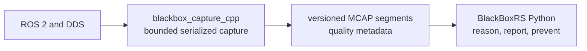
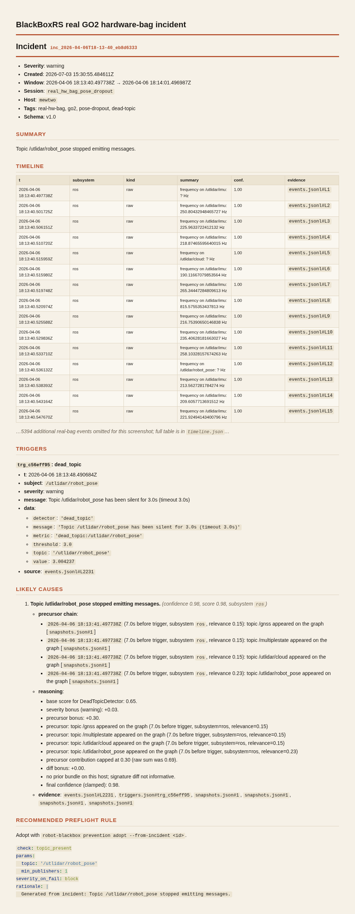
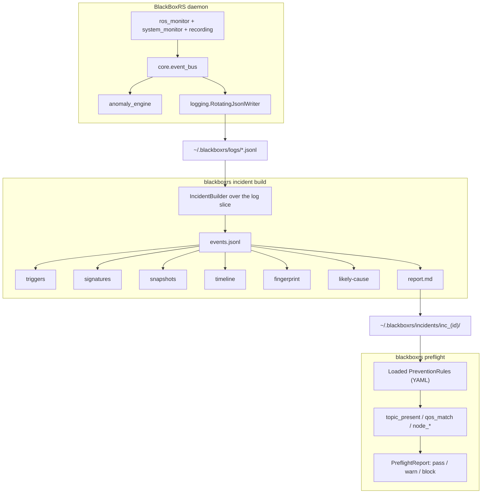

# BlackBoxRS

**Incident intelligence for ROS 2 robots.** When something breaks in the field, you get a bundle you can read, not a log you have to excavate.


-brightgreen)


When a ROS 2 robot misbehaves in the field, the honest answer to "what just happened?" is usually an afternoon of SSH, `journalctl`, and Slack archaeology. BlackBoxRS turns that afternoon into a paragraph.

It runs a lightweight daemon that watches the ROS 2 graph, host, and (optionally) an off-board observer. When a failure fires, one command builds a reproducible **incident bundle**: a timeline, the raw evidence, config and version signatures, a likely-cause narrative grounded in that evidence, and a preflight rule you can adopt so the same failure blocks the next launch instead of recurring on a different robot two weeks later.

The bundle is the artifact. Everything else is plumbing.

---

## Bounded native capture plane

BlackBoxRS separates high-rate evidence capture from incident intelligence. A
bounded C++ ROS 2 recorder owns the ingestion hot path; Python owns incident
construction, causal ranking, replay, reporting, and prevention.



The `rclcpp` component captures configured topics through generic serialized
subscriptions, records steady and ROS clocks, orders graph and trigger events in
the same chronology, and writes through a fixed-capacity descriptor ring and
fixed-block payload arena. The capture-owned allocation estimate must fit the
configured memory ceiling before startup. Low-priority traffic is shed at the
configured watermark, every post-callback recorder drop is counted by topic and
reason, and upstream delivery limitations explicitly make evidence incomplete.

Continuous history is bounded by bytes and segment count. A native trigger closes
the post-trigger window and publishes a versioned incident manifest with the
actual retained interval. Python reads that evidence through
`NativeCaptureReader`; it does not reimplement MCAP details or move semantic
incident logic into C++.

The existing Python capture backend remains the default:

```yaml
capture:
  backend: python
```

Native capture is opt-in while the promotion gates are evaluated. See
[native capture architecture](docs/native_capture_architecture.md),
[format contract](docs/native_capture_format.md), and
[promotion gate](docs/native_capture_promotion_gate.md). The repository includes
a configurable ROS 2 load generator and machine-readable benchmark supervisor,
but this README makes no performance claim without retained benchmark artifacts.

After building and sourcing the ROS workspace, the daemon owns the native process
when configured with:

```yaml
capture:
  backend: cpp
  topics: [/imu/data, /joint_states, /cmd_vel, /tf, /tf_static]
  native_output_dir: ~/.blackboxrs/native
```

The recorder publishes a READY session pointer, the daemon supervises clean
shutdown, and incident bundles copy selected MCAP evidence into attachments. The
output root is capped across restarts by native storage parameters. Python remains
active for semantic detectors and incident intelligence.

---

## The problem, concretely

A ROS 2 robot fails on a field test. Today that costs you:

1. Engineer SSHs in, runs `ros2 topic list`, scrolls `journalctl`, greps. Twenty to ninety minutes per incident.
2. Log fragments get pasted into Slack; three engineers reconstruct the timeline from memory.
3. The "fix" is a one-line config change with no record of *why*.
4. The same failure recurs on a different robot two weeks later, and nobody connects the two.

With BlackBoxRS the daemon is already running, so the failure is already captured:

```
robot-blackbox incident build --since 5m
# -> ~/.blackboxrs/incidents/inc_2026-05-07T14-22-00_a3f2/
#    ├── report.md
#    ├── manifest.json
#    ├── incident.json
#    ├── timeline.json
#    ├── fingerprint.json
#    ├── signatures/{config.json, versions.json}
#    └── evidence/{events.jsonl, triggers.json, snapshots.json}
```

You read `report.md`. The likely cause is named with a confidence score, and every claim in it links straight to the evidence file that backs it (`events.jsonl#L11`, `triggers.json#trg_df6aa081`). One command converts the incident into a `PreventionRule`, and `robot-blackbox preflight` fires that rule before the next launch.

Before downstream use, the bundle can verify itself:

```bash
robot-blackbox incident verify ~/.blackboxrs/incidents/inc_*
```

New bundles are written through a staging directory and finalized with a root `manifest.json`. The manifest records bundle format version, producer metadata, required/optional file paths, byte sizes, and SHA-256 checksums. This detects incomplete or modified local artifacts. Finalized bundles are closed to late `incident attach` mutations. The manifest is not a signature, authentication system, or tamper-proof security mechanism.

---

## It runs on real GO2 data

The offline replay path has been run against a genuine `rosbag2` recording from a physical Unitree GO2 (not simulation): `/utlidar/robot_pose`, `/utlidar/imu`, `/utlidar/cloud`, `/gnss`, `/multiplestate`, about 94k messages over a 330-second session. Played untouched, it replays clean end to end (zero anomalies), which is the point: the detectors aren't inventing failures. Inject a `/utlidar/robot_pose` dropout into an otherwise-real window and the real `DeadTopicDetector` finds it from bag timing alone.

One honest boundary: BlackBoxRS has **not** run in a closed control loop on a live robot. The loop it closes here is record-then-replay, off to the side of the robot's own stack. A live onboard capture during a real field failure is the one thing still owed (see [What's next](#whats-next)).

Reproduce it against your own recording (the source bag is ~680&nbsp;MB and is not checked in):

```
robot-blackbox replay-bag <path-to-your-rosbag2-dir> \
  --drop-topic /utlidar/robot_pose --drop-after 60 --timeout 3.0
```

The committed example trims that same recording to a 20-second window so the checked-in artifact stays small:

```
$ python scripts/generate_real_hw_bag_incident.py --bag /path/to/extended_5min
Dead topic detected: /utlidar/robot_pose silent for 3.0s
Real-hw-bag bundle: examples/incidents/inc_real_hw_bag_pose_dropout
  events=5439 topics=['/gnss', '/multiplestate', '/utlidar/cloud', '/utlidar/imu', '/utlidar/robot_pose']
  anomaly: /utlidar/robot_pose silent 3.0s @ 2026-04-06T18:13:48.490684+00:00
```

The incident report it generated:



Full bundle: `examples/incidents/inc_real_hw_bag_pose_dropout/`. Its sim-bag sibling (`inc_real_bag_odom_dropout/`) runs through the exact same code path.

---

## Where it runs

BlackBoxRS does not need to live on the robot.

| Mode | Where it runs | When to use |
|---|---|---|
| **Onboard** (default) | Same host as the ROS 2 graph (Jetson, NUC, on-robot workstation). | You have shell access and want host metrics (CPU, memory, per-process CPU/RSS) in the bundle. |
| **Observer** | Any workstation that can `ros2 topic list` against the robot over DDS. No SSH, no per-robot install. | You're debugging from a laptop, the robot's compute is locked down, or a whole team needs to capture bundles without each person installing a daemon on the robot. |

Observer mode is one config flag:

```yaml
# ~/.blackboxrs/config.yaml
runtime:
  role: observer
  observed_host: go2-edu-01     # free-form label, ends up in every bundle
```

The DDS-bound detectors keep working because they watch the robot's published graph. Host thresholds (CPU, memory) would describe the observer laptop rather than the robot, so the system-monitor pipeline that feeds them auto-disables, and `process_signals` disables with it. Every bundle records both `observer_host` and `observed_host`, so the report names the two sides instead of quietly conflating them.

All seven detectors ship live: `threshold`, `frequency`, `dead_topic`, `qos_mismatch`, `tf_topology`, `clock_skew`, and `process_signals`. See `docs/QUICKSTART_REMOTE.md` for the five-minute walkthrough from `pip install` to a first remote-captured bundle.

---

## The loop


`observe` was the v0.3 wedge. `explain -> replay -> prevent` is what turns a recorder into a tool.

---

## Two-minute replay-to-prevention demo

Run the deterministic offline prevention loop:

```bash
./examples/demo_replay_prevention_loop.py
```

Expected high-level output:

```text
[1/5] Replaying recorded robot failure
  incident_id: inc_...
  source_trigger_id: trg_...
  detector_class: ...DeadTopicDetector
  source_event_ref: events.jsonl#L...
  confidence: 0.98
  silence_precursor: silence interval on /die: 2.6s gap (timeout 2.0s)

[2/5] Adopting and persisting prevention rule
  rule_id: rule_...
  rule_type: topic_present
  source_incident_id: inc_...
  source_fingerprint: fpr_...
  source_trigger_id: trg_...

[3/5] Proving the matching bad launch condition is blocked
[  BLOCK] topic_present ...

[4/5] Proving a nearby valid launch condition passes
[   PASS] topic_present ...

[5/5] Evidence summary
PASS: recorded incident produced structured evidence
PASS: prevention rule retained source provenance
PASS: matching launch condition was blocked
PASS: nearby valid configuration passed
BOUNDARY: offline deterministic replay; no live robot validation
```

This deterministic offline demo replays a supported recorded incident,
derives a traceable prevention rule, and verifies that matching
launch-time conditions are blocked through the public BlackBoxRS CLI. It
does not constitute live robot or onboard prevention validation.

Dependencies: Python 3.10+, the normal BlackBoxRS Python dependencies,
and no ROS 2 daemon or physical robot. The demo creates a temporary
sqlite rosbag2 fixture, incident bundle, and rule directory, then removes
them when it exits. The unrelated-trigger adoption guard is kept as a
regression test in `tests/unit/test_prevention_derivation.py` rather than
shown in the two-minute walkthrough.

---

## A sample bundle

`examples/incidents/inc_demo_tf_break/` is a synthetic-but-realistic TF-break incident, committed to the repo and generated by real code. The top of its `report.md`:

```
# Incident `inc_2026-05-07T14-22-00_04ca9c43`

- **Severity**: error
- **Window**: 2026-05-07 14:22:00.000Z -> 2026-05-07 14:22:15.000Z
- **Session**: `demo_tf_break`
- **Host**: `dev-workstation`

## Summary

Topic /tf_static stopped emitting messages.

## Timeline

| t                          | subsystem | kind    | summary                        | conf. | evidence                  |
|----------------------------|-----------|---------|--------------------------------|-------|---------------------------|
| 2026-05-07 14:22:00.000Z   | ros       | raw     | frequency on /tf_static: 1.0Hz | 1.00  | events.jsonl#L1           |
| ...                        | ...       | ...     | ...                            | ...   | ...                       |
| 2026-05-07 14:22:08.000Z   | anomaly   | trigger | dead_topic on /tf_static       | 1.00  | triggers.json#trg_df6aa081 |

## Likely causes

1. **Topic /tf_static stopped emitting messages.** _(confidence 1.00)_
   - evidence: `events.jsonl#L11`, `triggers.json#trg_df6aa081`

## Fingerprint

- id: `fpr_68463b41f2ab8910`
- detectors: `DeadTopicDetector`
- subsystems: `anomaly`

## Recommended preflight rule

check: topic_present
params:
  topic: '/tf_static'
  min_publishers: 1
severity_on_fail: block
```

Read the whole committed report without running anything:

```bash
robot-blackbox incident show examples/incidents/inc_demo_tf_break/
```

---

## What works today

- **Capture.** The compatibility Python backend keeps ROS 2 topic introspection, JSONL rotation, host telemetry, and optional anomaly-triggered `rosbag2` recording. The opt-in `blackbox_capture_cpp` backend adds bounded generic serialized ingestion, graph chronology, dual clocks, explicit loss accounting, rolling MCAP retention, and pre/post-trigger manifests. Both feed the same Python incident intelligence. The seven semantic detectors remain `threshold`, `frequency`, `dead_topic`, `qos_mismatch`, `tf_topology`, `clock_skew`, and `process_signals`. Measured detector FPR/TPR is published in `docs/DETECTOR_CHARACTERISTICS.md`.
- **Incident bundles.** `IncidentBuilder` slices the JSONL log into a typed bundle: events, triggers, signatures, timeline, fingerprint, report. New bundles are staged, validated, checksummed, and atomically published on first creation with a root `manifest.json`.
- **Grounded reports.** Every claim in `report.md` resolves to a file in the bundle (`events.jsonl#Ln`, `triggers.json#<id>`). No orphan assertions.
- **Deterministic signatures.** sha256 over ROS distro, RMW, an env subset, attached files, and OS / Python / driver state. Same inputs, same hash.
- **Failure fingerprinting (v1).** A stable id from detector classes, subsystems, signature fields, and topic-set topology. Seed two bundles identically and they collide; perturb any input and the id moves.
- **Likely-cause ranking.** Detector-class weight plus a severity bonus. Confidence below 0.5 carries an explicit caveat; at or above 0.7 the cause is promoted to the summary. Weights are hand-calibrated (`blackboxrs/incident/cause.py:8-18`).
- **Prevention.** `PreventionRule` + `PreflightCheck` YAML I/O and a `PreflightRunner` with 0/1/2 exit codes (pass / block / warn). Derived rules record the source incident, fingerprint, trigger id, detector class, and evidence ref that justified the rule. Rule derivation and adoption require a finalized, integrity-valid bundle. Active blocking rules fail closed when a check errors or cannot run. All seven check kinds are real: `topic_present`, `qos_match`, `node_running` are live rclpy graph queries; `env_var`, `param_value`, `resource_threshold`, `custom_python` run against `os.environ`, the ROS 2 parameter API, `psutil`, and a user-supplied import path. Unknown kinds raise at load time, never silently skip.
- **Observer mode, end to end.** `tests/integration/test_observer_live.py` boots a real rclpy publisher and asserts an observer-role daemon fires `anomaly.dead_topic` over DDS within 5s of the publisher going quiet, inside the Docker Humble CI job.
- **Offline bag replay.** `robot-blackbox replay-bag` replays recorded `.mcap` or `.db3` topic-arrival timing through the real `DeadTopicDetector`, entirely offline, with a virtual clock pinned to bag time. It reads `.db3` split files (the chunks `ros2 bag record` produces on a long session) by merging every file `metadata.yaml` lists, not just the first one, a bug that had been silently dropping ~9% of messages. A hardware-free integration test covers the public replay -> adopt -> preflight path for a structured dead-topic incident: the derived rule preserves incident, fingerprint, trigger, detector, and event provenance, blocks a matching missing-topic preflight, and passes a nearby healthy graph.
- **CLI.** `robot-blackbox incident build / show / list / attach / verify / replay`, `preflight`, `prevention adopt --from-incident / list`, `replay-bag`.
- **CI covers lint, unit, and integration tests** on Python 3.10 / 3.11 / 3.12, plus a benchmark regression gate, a detector-FPR smoke run, and a live ROS 2 Humble Docker job. ROS- and real-bag-dependent checks are gated when their runtime dependencies are absent.

## What's next

- **Live onboard capture.** The committed real-hardware evidence is offline replay of a real GO2 bag. A bundle captured live, on the robot, during an actual field failure is the single largest remaining gap and the next thing to land.
- **Cross-incident clustering.** `cluster_id` is already reserved on `FailureFingerprint`; targeted for v0.5.
- **`incident pack` / `unpack`** for portable tarballs built on top of manifest verification.

Deliberately out of scope for now: a web dashboard and multi-host capture. Single-host first, and the bundle is the artifact. The bundle format is forward-compatible when multi-host arrives.

---

## Quick start

```bash
git clone https://github.com/yusufdxb/BlackBoxRS.git
cd BlackBoxRS
./setup.sh
source .venv/bin/activate

robot-blackbox init                    # 1. initialise
robot-blackbox start --foreground &    # 2. run the daemon (-f shows live output)
                                       # 3. ... your robot runs, anomalies fire and get logged ...
robot-blackbox incident build --since 5m                                    # 4. build a bundle
robot-blackbox incident show ~/.blackboxrs/incidents/inc_*                  # 5. read the report
robot-blackbox prevention adopt --from-incident ~/.blackboxrs/incidents/inc_*  # 6. adopt a rule
robot-blackbox preflight               # 7. next launch: the rule fires first
```

### Observer mode (from a laptop)

The steps above run the daemon on the robot. To capture incidents from a workstation that already sees the robot's topics over DDS:

```bash
# Robot on the same DDS domain (ROS_DOMAIN_ID and RMW_IMPLEMENTATION match).
ros2 topic list                        # must return the robot's topics

robot-blackbox init
cat > ~/.blackboxrs/config.yaml <<'YAML'
runtime:
  role: observer
  observed_host: go2-edu-01
YAML

robot-blackbox start --foreground &
# ... drive the robot, watch a failure ...
robot-blackbox incident build --since 5m
robot-blackbox incident show ~/.blackboxrs/incidents/inc_*
```

The bundle's `report.md` names both sides:

```
- **Observer**: `my-laptop`
- **Observed**: `go2-edu-01`
```

Host-bound collectors skip themselves automatically, because per-process CPU/RSS and host thresholds would describe the observer laptop rather than the robot. See `docs/QUICKSTART_REMOTE.md` for DDS setup, troubleshooting, and what each detector measures in observer mode.

---

## Architecture



See `docs/ARCHITECTURE.md` for the full system design.

---

## License

MIT. See `LICENSE`.

## Author

Yusuf Guenena ([yusufdxb](https://github.com/yusufdxb)).
