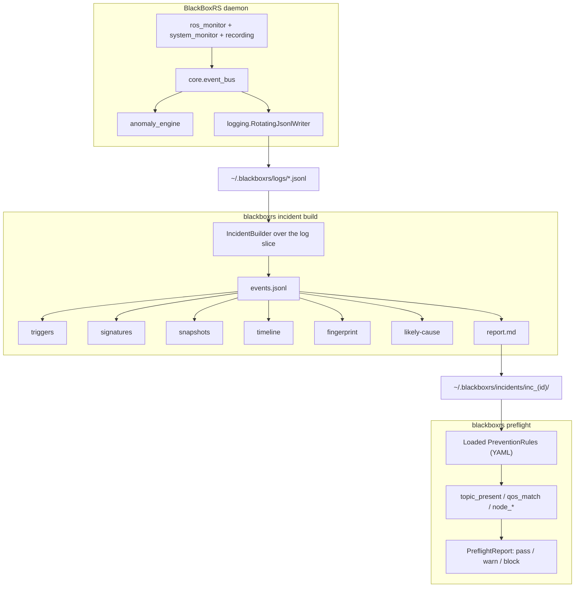

# BlackBoxRS

**Incident intelligence for ROS 2 robots.** When something breaks in the field, you get a bundle you can read, not a log you have to excavate.


-brightgreen)


When a ROS 2 robot misbehaves in the field, the honest answer to "what just happened?" is usually an afternoon of SSH, `journalctl`, and Slack archaeology. BlackBoxRS turns that afternoon into a paragraph.

It runs a lightweight daemon that watches the ROS 2 graph, host, and (optionally) an off-board observer. When a failure fires, one command builds a reproducible **incident bundle**: a timeline, the raw evidence, config and version signatures, a likely-cause narrative grounded in that evidence, and a preflight rule you can adopt so the same failure blocks the next launch instead of recurring on a different robot two weeks later.

The bundle is the artifact. Everything else is plumbing.

---

## The problem, concretely

A ROS 2 robot fails on a field test. Today that costs you:

1. Engineer SSHs in, runs `ros2 topic list`, scrolls `journalctl`, greps. Twenty to ninety minutes per incident.
2. Log fragments get pasted into Slack; three engineers reconstruct the timeline from memory.
3. The "fix" is a one-line config change with no record of *why*.
4. The same failure recurs on a different robot two weeks later, and nobody connects the two.

With BlackBoxRS the daemon is already running, so the failure is already captured:

```
robot-blackbox incident build --since 5m
# -> ~/.blackboxrs/incidents/inc_2026-05-07T14-22-00_a3f2/
#    ├── report.md
#    ├── incident.json
#    ├── timeline.json
#    ├── fingerprint.json
#    ├── signatures/{config.json, versions.json}
#    └── evidence/{events.jsonl, triggers.json, snapshots.json}
```

You read `report.md`. The likely cause is named with a confidence score, and every claim in it links straight to the evidence file that backs it (`events.jsonl#L11`, `triggers.json#trg_df6aa081`). One command converts the incident into a `PreventionRule`, and `robot-blackbox preflight` fires that rule before the next launch.

---

## It runs on real GO2 data

The offline replay path has been run against a genuine `rosbag2` recording from a physical Unitree GO2 (not simulation): `/utlidar/robot_pose`, `/utlidar/imu`, `/utlidar/cloud`, `/gnss`, `/multiplestate`, about 94k messages over a 330-second session. Played untouched, it replays clean end to end (zero anomalies), which is the point: the detectors aren't inventing failures. Inject a `/utlidar/robot_pose` dropout into an otherwise-real window and the real `DeadTopicDetector` finds it from bag timing alone.

One honest boundary: BlackBoxRS has **not** run in a closed control loop on a live robot. The loop it closes here is record-then-replay, off to the side of the robot's own stack. A live onboard capture during a real field failure is the one thing still owed (see [What's next](#whats-next)).

Reproduce it against your own recording (the source bag is ~680&nbsp;MB and is not checked in):

```
robot-blackbox replay-bag <path-to-your-rosbag2-dir> \
  --drop-topic /utlidar/robot_pose --drop-after 60 --timeout 3.0
```

The committed example trims that same recording to a 20-second window so the checked-in artifact stays small:

```
$ python scripts/generate_real_hw_bag_incident.py --bag /path/to/extended_5min
Dead topic detected: /utlidar/robot_pose silent for 3.0s
Real-hw-bag bundle: examples/incidents/inc_real_hw_bag_pose_dropout
  events=5439 topics=['/gnss', '/multiplestate', '/utlidar/cloud', '/utlidar/imu', '/utlidar/robot_pose']
  anomaly: /utlidar/robot_pose silent 3.0s @ 2026-04-06T18:13:48.490684+00:00
```

The incident report it generated:


Full bundle: `examples/incidents/inc_real_hw_bag_pose_dropout/`. Its sim-bag sibling (`inc_real_bag_odom_dropout/`) runs through the exact same code path.

---

## Where it runs

BlackBoxRS does not need to live on the robot.

| Mode | Where it runs | When to use |
|---|---|---|
| **Onboard** (default) | Same host as the ROS 2 graph (Jetson, NUC, on-robot workstation). | You have shell access and want host metrics (CPU, memory, per-process CPU/RSS) in the bundle. |
| **Observer** | Any workstation that can `ros2 topic list` against the robot over DDS. No SSH, no per-robot install. | You're debugging from a laptop, the robot's compute is locked down, or a whole team needs to capture bundles without each person installing a daemon on the robot. |

Observer mode is one config flag:

```yaml
# ~/.blackboxrs/config.yaml
runtime:
  role: observer
  observed_host: go2-edu-01     # free-form label, ends up in every bundle
```

The DDS-bound detectors keep working because they watch the robot's published graph. Host thresholds (CPU, memory) would describe the observer laptop rather than the robot, so the system-monitor pipeline that feeds them auto-disables, and `process_signals` disables with it. Every bundle records both `observer_host` and `observed_host`, so the report names the two sides instead of quietly conflating them.

All seven detectors ship live: `threshold`, `frequency`, `dead_topic`, `qos_mismatch`, `tf_topology`, `clock_skew`, and `process_signals`. See `docs/QUICKSTART_REMOTE.md` for the five-minute walkthrough from `pip install` to a first remote-captured bundle.

---

## The loop


`observe` was the v0.3 wedge. `explain -> replay -> prevent` is what turns a recorder into a tool.

---

## Runtime telemetry-health guard

### Problem

ROS graph structure alone cannot distinguish a healthy publisher from a
publisher that remains present but stops delivering useful telemetry. A
`topic_present` rule can therefore pass while the topic is silent.

BlackBoxRS closes a bounded failure-to-prevention loop:

```text
runtime failure -> incident evidence -> derived contract -> trusted adoption -> runtime enforcement
```

The runtime contract checks one fully qualified topic, exact type and QoS,
runtime context, aggregate arrival freshness and rate, and monotonic header
progress. It qualifies telemetry before launching a foreground dependent and
continues supervision after launch.

### Genuine GO2 result

A clean, read-only reproduction used one 329.6-second physical-GO2 rosbag2
session containing 94,325 messages across six topics. The selected
`/utlidar/robot_pose` stream contained 6,177 `PoseStamped` messages at a mean
18.7468 Hz rate, with a 70.8 ms maximum healthy gap. The derived local
contract selected a 15.0 Hz hard minimum and 150 ms stale timeout.

In the controlled comparison, no-rule and topic-presence checks admitted a
publisher-present silent condition. The hardened guard detected the same
silence about 151 ms after the final message and enforced the dependent
process boundary. It admitted 6/6 selected nearby valid cases and blocked 7/7
selected invalid cases. Three additional 15.1 Hz multi-phase jitter cases
passed. The repeated boundary experiment blocked 20/20 selected 14.9 Hz
constant and 20/20 selected 14.9 Hz jitter cases, while admitting 20/20
selected 15.0 Hz constant, 20/20 selected 15.1 Hz constant, and 20/20
selected 15.1 Hz jitter cases. The clean baseline regression completed with
653 passed and 4 optional-MCAP skips. The public fixture demo below is not a
substitute for this genuine-bag result.

### Public deterministic reproduction

The repository includes a small generated provenance fixture, so the demo does
not require the private 681,996,932-byte GO2 bag:

```bash
source /opt/ros/humble/setup.bash
export ROS_LOCALHOST_ONLY=1
OUT="$(mktemp -d /tmp/blackboxrs-telemetry-demo.XXXXXX)"
python3 examples/demo_runtime_telemetry_health.py \
  --out "$OUT" --domain-start 180
jq '.checks' "$OUT/demo_summary.json"
```

The demo shows a healthy publisher qualifying, a harmless dependent starting,
the publisher remaining alive while becoming silent, the presence-only rule
passing, the runtime guard detecting stale telemetry and terminating the
dependent, and a nearby 18.75 Hz stream passing. It calls the production
adoption and guard paths. The generated bag and incident are deterministic
fixtures, not genuine robot data. See
[the recording guide](docs/RUNTIME_TELEMETRY_DEMO.md) and the curated
[genuine-data summary](examples/telemetry_health/genuine_go2_evidence_summary.json).

### Tested adversarial boundaries

- Global topic remapping cannot redirect the contract subscription.
- Wrong namespace, runtime context, message type, or incompatible QoS blocks.
- Incident, event, bag, metadata, evidence, threshold, and locally pinned rule
  fingerprint tampering fails closed.
- The supported Linux foreground process tree is cleaned on caught termination
  and tested `SIGKILL` paths.
- New process groups, `setsid()`, double-forking, and daemonization are rejected.
- Aggregate topic traffic can remain healthy when one publisher is stale or
  disappears. This is not a specific-producer health claim.

### Limitations

This result uses one genuine session in local ROS 2 Humble with Fast DDS. It
covers aggregate topic health, not a particular publisher. It does not validate
pose values or claim payload-semantic freshness. It does not demonstrate live
physical prevention, field safety, multi-robot generality, or population error
rates. Thresholds are session-derived. Process ownership is a bounded Linux
foreground-command model using process groups, `/proc`, and signals, not
universal descendant cleanup or cgroup ownership.

> In a bounded local ROS 2 evaluation, BlackBoxRS derived a telemetry-health contract from genuine GO2 bag evidence and prevented selected semantic liveness failures, including publisher-present silence and sustained under-rate telemetry, while admitting selected nearby healthy conditions. The hardened guard rejected topic remapping, runtime-context mismatch, provenance tampering, and unsupported dependent-process escape within its documented Linux process model. Thresholds remain session-derived and require multi-session and live-robot validation.

---

## A sample bundle

`examples/incidents/inc_demo_tf_break/` is a synthetic-but-realistic TF-break incident, committed to the repo and generated by real code. The top of its `report.md`:

```
# Incident `inc_2026-05-07T14-22-00_04ca9c43`

- **Severity**: error
- **Window**: 2026-05-07 14:22:00.000Z -> 2026-05-07 14:22:15.000Z
- **Session**: `demo_tf_break`
- **Host**: `dev-workstation`

## Summary

Topic /tf_static stopped emitting messages.

## Timeline

| t                          | subsystem | kind    | summary                        | conf. | evidence                  |
|----------------------------|-----------|---------|--------------------------------|-------|---------------------------|
| 2026-05-07 14:22:00.000Z   | ros       | raw     | frequency on /tf_static: 1.0Hz | 1.00  | events.jsonl#L1           |
| ...                        | ...       | ...     | ...                            | ...   | ...                       |
| 2026-05-07 14:22:08.000Z   | anomaly   | trigger | dead_topic on /tf_static       | 1.00  | triggers.json#trg_df6aa081 |

## Likely causes

1. **Topic /tf_static stopped emitting messages.** _(confidence 1.00)_
   - evidence: `events.jsonl#L11`, `triggers.json#trg_df6aa081`

## Fingerprint

- id: `fpr_68463b41f2ab8910`
- detectors: `DeadTopicDetector`
- subsystems: `anomaly`

## Recommended preflight rule

check: topic_present
params:
  topic: '/tf_static'
  min_publishers: 1
severity_on_fail: block
```

Read the whole thing without running anything:

```bash
robot-blackbox incident show examples/incidents/inc_demo_tf_break/
```

---

## What works today

- **Capture.** ROS 2 topic introspection and host telemetry feed seven anomaly detectors (`threshold`, `frequency`, `dead_topic`, `qos_mismatch`, `tf_topology`, `clock_skew`, `process_signals`), all with hysteresis (`min_consecutive_samples`, default 2) so a single noisy sample can't trip a false alarm. JSONL logging with size and age rotation; optional anomaly-triggered `rosbag2` recording. Measured FPR/TPR per detector is published in `docs/DETECTOR_CHARACTERISTICS.md`.
- **Incident bundles.** `IncidentBuilder` slices the JSONL log into a typed bundle: events, triggers, signatures, timeline, fingerprint, report.
- **Grounded reports.** Every claim in `report.md` resolves to a file in the bundle (`events.jsonl#Ln`, `triggers.json#<id>`). No orphan assertions.
- **Deterministic signatures.** sha256 over ROS distro, RMW, an env subset, attached files, and OS / Python / driver state. Same inputs, same hash.
- **Failure fingerprinting (v1).** A stable id from detector classes, subsystems, signature fields, and topic-set topology. Seed two bundles identically and they collide; perturb any input and the id moves.
- **Likely-cause ranking.** Detector-class weight plus a severity bonus. Confidence below 0.5 carries an explicit caveat; at or above 0.7 the cause is promoted to the summary. Weights are hand-calibrated (`blackboxrs/incident/cause.py:8-18`).
- **Prevention.** `PreventionRule` + `PreflightCheck` YAML I/O and a `PreflightRunner` with 0/1/2 exit codes (pass / block / warn). Derived rules record the source incident, fingerprint, trigger id, detector class, and evidence ref that justified the rule. Rule derivation and adoption require a finalized, integrity-valid bundle. Active blocking rules fail closed when a check errors or cannot run. All seven check kinds are real: `topic_present`, `qos_match`, `node_running` are live rclpy graph queries; `env_var`, `param_value`, `resource_threshold`, `custom_python` run against `os.environ`, the ROS 2 parameter API, `psutil`, and a user-supplied import path. Unknown kinds raise at load time, never silently skip.
- **Observer mode, end to end.** `tests/integration/test_observer_live.py` boots a real rclpy publisher and asserts an observer-role daemon fires `anomaly.dead_topic` over DDS within 5s of the publisher going quiet, inside the Docker Humble CI job.
- **Offline bag replay.** `robot-blackbox replay-bag` replays recorded `.mcap` or `.db3` topic-arrival timing through the real `DeadTopicDetector`, entirely offline, with a virtual clock pinned to bag time. It reads `.db3` split files (the chunks `ros2 bag record` produces on a long session) by merging every file `metadata.yaml` lists, not just the first one, a bug that had been silently dropping ~9% of messages. A hardware-free integration test covers the public replay -> adopt -> preflight path for a structured dead-topic incident: the derived rule preserves incident, fingerprint, trigger, detector, and event provenance, blocks a matching missing-topic preflight, and passes a nearby healthy graph.
- **CLI.** `robot-blackbox incident build / show / list / attach`, `preflight`, `prevention adopt --from-incident / list`, `replay-bag`.
- **653 baseline tests pass**, plus 4 optional-MCAP skips in the clean telemetry-health validation environment. CI runs lint + unit + integration on Python 3.10 / 3.11 / 3.12, a benchmark regression gate, a detector-FPR smoke run, and live ROS 2 Humble tests, including the telemetry guard adversarial suite, on every commit to `main`.

## What's next

- **Live onboard capture.** The committed real-hardware evidence is offline replay of a real GO2 bag. A bundle captured live, on the robot, during an actual field failure is the single largest remaining gap and the next thing to land.
- **Cross-incident clustering.** `cluster_id` is already reserved on `FailureFingerprint`; targeted for v0.5.
- **`incident pack` / `unpack`** for portable tarballs.

Deliberately out of scope for now: a web dashboard and multi-host capture. Single-host first, and the bundle is the artifact. The bundle format is forward-compatible when multi-host arrives.

---

## Quick start

```bash
git clone https://github.com/yusufdxb/BlackBoxRS.git
cd BlackBoxRS
./setup.sh
source .venv/bin/activate

robot-blackbox init                    # 1. initialise
robot-blackbox start --foreground &    # 2. run the daemon (-f shows live output)
                                       # 3. ... your robot runs, anomalies fire and get logged ...
robot-blackbox incident build --since 5m                                    # 4. build a bundle
robot-blackbox incident show ~/.blackboxrs/incidents/inc_*                  # 5. read the report
robot-blackbox prevention adopt --from-incident ~/.blackboxrs/incidents/inc_*  # 6. adopt a rule
robot-blackbox preflight               # 7. next launch: the rule fires first
```

### Observer mode (from a laptop)

The steps above run the daemon on the robot. To capture incidents from a workstation that already sees the robot's topics over DDS:

```bash
# Robot on the same DDS domain (ROS_DOMAIN_ID and RMW_IMPLEMENTATION match).
ros2 topic list                        # must return the robot's topics

robot-blackbox init
cat > ~/.blackboxrs/config.yaml <<'YAML'
runtime:
  role: observer
  observed_host: go2-edu-01
YAML

robot-blackbox start --foreground &
# ... drive the robot, watch a failure ...
robot-blackbox incident build --since 5m
robot-blackbox incident show ~/.blackboxrs/incidents/inc_*
```

The bundle's `report.md` names both sides:

```
- **Observer**: `my-laptop`
- **Observed**: `go2-edu-01`
```

Host-bound collectors skip themselves automatically, because per-process CPU/RSS and host thresholds would describe the observer laptop rather than the robot. See `docs/QUICKSTART_REMOTE.md` for DDS setup, troubleshooting, and what each detector measures in observer mode.

---

## Architecture



See `docs/ARCHITECTURE.md` for the full system design.

---

## License

MIT. See `LICENSE`.

## Author

Yusuf Guenena ([yusufdxb](https://github.com/yusufdxb)).
