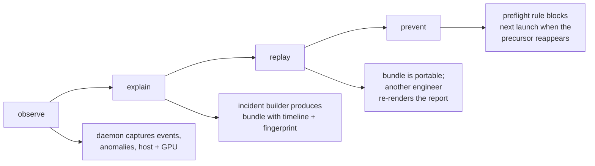
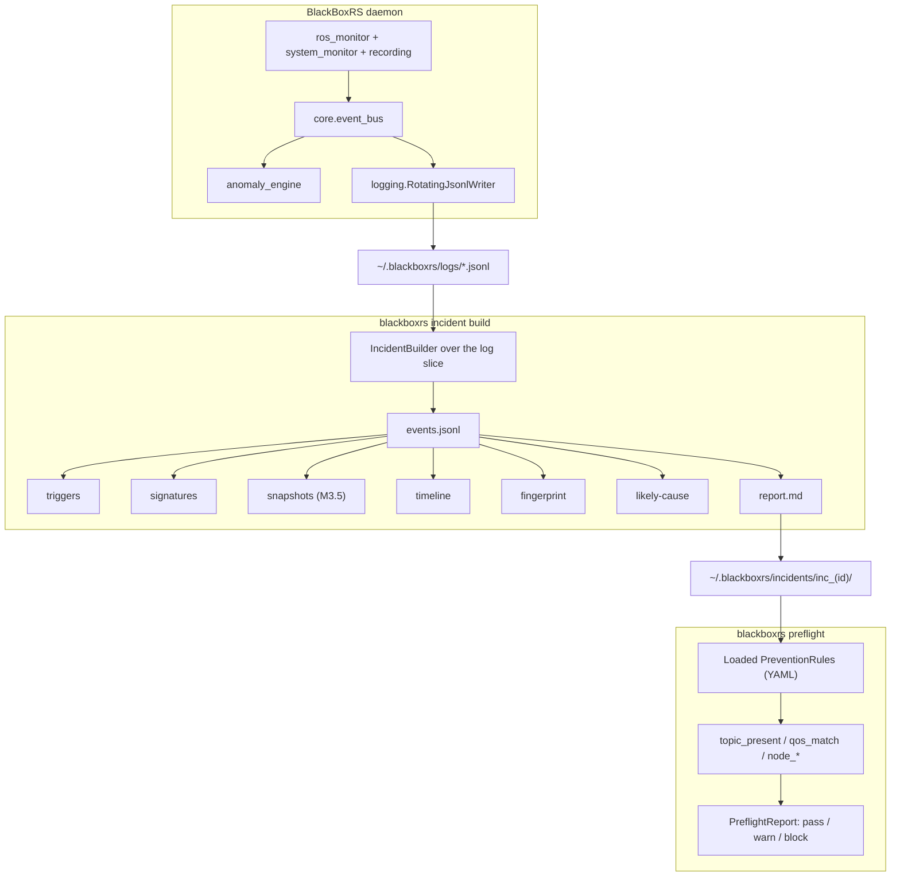

# BlackBoxRS

**Incident intelligence and prevention for ROS 2 robots.**


-brightgreen)


> Status: **alpha (v0.4.0.dev0)**. The incident-bundle pipeline, report
> generator, fingerprinting, prevention runner, and observer-mode
> (off-board capture) are working. Three evidence-breadth detectors
> (`tf_topology`, `clock_skew`, `process_signals`) are scaffolded and
> tested but **not wired into the live engine until their producers
> ship** — see "What is planned" below. The single source of truth for
> the package version is `pyproject.toml`; `blackboxrs.__version__`
> reads it via `importlib.metadata`. See `STATUS_AND_LIMITATIONS_REWRITE.md`
> for the full verified-vs-planned breakdown.

When a ROS 2 robot fails, BlackBoxRS produces a reproducible incident
bundle: timeline, evidence, config and version signatures, a likely-cause
narrative grounded in the evidence, and a recommended preflight rule the
next launch can run to keep the same failure from happening again.

The bundle is the artifact. Postmortems collapse from an afternoon to a
paragraph.

---

## Where to run it

BlackBoxRS does not need to live on the robot.

| Mode | Where it runs | When to use |
|---|---|---|
| **Onboard** (default) | Same host as the ROS 2 node graph (Jetson, NUC, on-robot workstation). | You have shell access to the robot and want host metrics (CPU, memory, per-process CPU/RSS) in the bundle. |
| **Observer** | Any workstation that can `ros2 topic list` against the robot over DDS. No SSH, no per-robot install. | You're debugging a robot from a laptop, the robot's compute is locked down, or a whole team needs to capture bundles without each user setting up a daemon on the robot. |

Observer mode is a single config flag:

```yaml
# ~/.blackboxrs/config.yaml
runtime:
  role: observer
  observed_host: go2-edu-01     # free-form label, ends up in every bundle
```

DDS-bound detectors that are live today (frequency, dead topic, QoS
mismatch) keep running because they observe the robot's published
graph. Host-bound thresholds (CPU / memory on the local machine)
describe the observer, not the robot, so the system-monitor pipeline
that feeds them is auto-disabled. Every incident bundle records both
`observer_host` and `observed_host` so reports name the two sides
explicitly.

Three additional detectors (`tf_topology`, `clock_skew`,
`process_signals`) are implemented and unit-tested but not wired into
the live engine: they consume producer events (`ros.tf`,
`system.clock_skew`, `system.process_signals`) that no module emits
yet. When their producers ship the detectors come back online — see
`STATUS_AND_LIMITATIONS_REWRITE.md`.

See `docs/QUICKSTART_REMOTE.md` for a 5-minute walkthrough from
`pip install` to the first remote-captured bundle.

---

## What problem this solves

Field robotics teams running ROS 2 lose hours per week to "why isn't
this running like yesterday?" Logs are not an answer; they are raw
material. Today, when a robot fails on a field test:

1. Engineer SSHs in, `ros2 topic list`, scrolls journalctl, greps. 20 to
   90 minutes per incident.
2. They paste log fragments into Slack. Three other engineers compare
   notes from memory.
3. The "fix" is a one-line config change with no record of *why*.
4. The same failure recurs on a different robot two weeks later.

After BlackBoxRS:

```
robot-blackbox start                   # already running on the robot
# robot fails
robot-blackbox incident build --since 5m
# → ~/.blackboxrs/incidents/inc_2026-05-07T14-22-00_a3f2/
#   ├── report.md
#   ├── incident.json
#   ├── timeline.json
#   ├── fingerprint.json
#   ├── signatures/{config.json, versions.json}
#   └── evidence/{events.jsonl, triggers.json, snapshots.json}
```

Engineer reads `report.md`, the likely cause is named with confidence
and the supporting evidence is hyperlinked into the bundle. They convert
it to a `PreventionRule` with one command. The next launch runs
`robot-blackbox preflight` and the rule fires before the failure.

---

## The loop



`observe` was the v0.3 wedge. `explain → replay → prevent` is what makes
this a product.

---

## Sample incident

`examples/incidents/inc_demo_tf_break/` is a synthetic but realistic
TF-break incident bundle, committed to the repo. The top of its
`report.md`:

```
# Incident `inc_2026-05-07T14-22-00_04ca9c43`

- **Severity**: error
- **Window**: 2026-05-07 14:22:00.000Z → 2026-05-07 14:22:15.000Z
- **Session**: `demo_tf_break`
- **Host**: `mewtwo`

## Summary

Topic /tf_static stopped emitting messages.

## Timeline

| t                          | subsystem | kind    | summary                        | conf. | evidence                  |
|----------------------------|-----------|---------|--------------------------------|-------|---------------------------|
| 2026-05-07 14:22:00.000Z   | ros       | raw     | frequency on /tf_static: 1.0Hz | 1.00  | events.jsonl#L1           |
| ...                        | ...       | ...     | ...                            | ...   | ...                       |
| 2026-05-07 14:22:08.000Z   | anomaly   | trigger | dead_topic on /tf_static       | 1.00  | triggers.json#trg_df6aa081 |

## Likely causes

1. **Topic /tf_static stopped emitting messages.** _(confidence 1.00)_
   - evidence: `events.jsonl#L11`, `triggers.json#trg_df6aa081`

## Fingerprint

- id: `fpr_68463b41f2ab8910`
- detectors: `DeadTopicDetector`
- subsystems: `anomaly`

## Recommended preflight rule

```yaml
check: topic_present
params:
  topic: '/tf_static'
  min_publishers: 1
severity_on_fail: block
```
```

Open `examples/incidents/inc_demo_tf_break/report.md` for the full
bundle.

---

## What works today (verified)

- **Existing v0.3 capture path** continues to work. ROS 2 topic
  introspection, host telemetry, GPU telemetry, four anomaly detectors
  (threshold, frequency drop, dead topic, QoS mismatch), JSONL logging
  with size + age rotation, optional anomaly-triggered rosbag2
  recording.
- **Incident bundle pipeline.** `IncidentBuilder` slices the JSONL log
  into a typed bundle: events, triggers, signatures, timeline,
  fingerprint, report.
- **Markdown report generator.** Every claim in `report.md` resolves to
  a file in the bundle (`events.jsonl#Ln`, `triggers.json#<id>`).
- **Config + version signatures.** Deterministic sha256 hashes of ROS
  distro, RMW, env subset, attached files, and OS / Python / NVIDIA
  driver state. Same inputs produce the same hash.
- **Failure fingerprinting (algorithm v1).** Stable id from detector
  classes, subsystems, signature fields, and topic-set topology. Two
  bundles seeded the same way collide; perturb any input and the id
  changes.
- **Likely-cause ranking.** Heuristic: detector-class weight + severity
  bonus. Confidence below 0.5 carries an explicit caveat. Confidence
  ≥ 0.7 is promoted to the bundle summary.
- **Prevention scaffold.** `PreventionRule` + `PreflightCheck` YAML I/O,
  `PreflightRunner` with 0/1/2 exit codes (pass / block / warn).
- **CLI.** `robot-blackbox incident build / show / list / attach`,
  `preflight`, `prevention adopt --from-incident / list`.
- **Sample bundle.** Reproducibly generated by
  `python scripts/generate_sample_incident.py`.
- **Runs onboard or off-board.** Same daemon, same bundle format. In
  observer mode the daemon attaches over DDS from any workstation that
  can already see the robot's topics, auto-disables host-bound
  collectors, and tags each bundle with both `observer_host` and
  `observed_host` so reports name the two sides explicitly.
- **Derived timeline events.** `timeline.json` folds silence-interval,
  resource-excursion, and graph-delta rows in alongside the raw and
  trigger rows; the cause ranker scores them as precursors.
- **Snapshot projection.** `SystemSnapshotter` projects the event
  stream into a typed `snapshots.json` series used by the derivers and
  the fingerprint topology signature.
- **Preflight checks.** `topic_present`, `qos_match`, and
  `node_running` are real rclpy-coupled graph queries. On a host with
  no `rclpy` installed they return `skipped` (and say so) rather than
  failing the launch.
- **384 tests pass** (363 unit + 21 integration/synthetic; run
  `pytest -q`). CI exercises Python 3.10 / 3.11 / 3.12 plus a live
  ROS 2 Humble Docker job on every main commit.

## What is planned (not yet built)

- Cross-incident clustering (`cluster_id` reserved on
  `FailureFingerprint`; v0.5).
- `incident pack` / `unpack` for portable tarballs (M7).
- Web dashboard. Out of scope for v0.4. The bundle is the artifact.
- Multi-host capture. Single-host first; the bundle format is
  forward-compatible.

For a brutally honest status breakdown see
`STATUS_AND_LIMITATIONS_REWRITE.md`.

---

## Quick start

```bash
git clone https://github.com/yusufdxb/BlackBoxRS.git
cd BlackBoxRS
./setup.sh
source .venv/bin/activate

# 1. Initialise.
robot-blackbox init

# 2. Run the daemon (foreground for the demo; -f shows live output).
robot-blackbox start --foreground &

# 3. ... your robot does its thing, anomalies fire and get logged ...

# 4. Build an incident bundle from the last 5 minutes.
robot-blackbox incident build --since 5m

# 5. Read the report.
robot-blackbox incident show ~/.blackboxrs/incidents/inc_*

# 6. Adopt a prevention rule from the incident.
robot-blackbox prevention adopt --from-incident ~/.blackboxrs/incidents/inc_*

# 7. On the next launch, run preflight.
robot-blackbox preflight
```

For the sample bundle without running anything:

```bash
robot-blackbox incident show examples/incidents/inc_demo_tf_break/
```

### Observer mode (remote workstation)

The quick start above runs the daemon on the robot. To capture
incidents from a laptop that already sees the robot's topics over
DDS:

```bash
# On your workstation. Robot is on the same DDS domain
# (e.g. ROS_DOMAIN_ID matches, RMW_IMPLEMENTATION matches).
ros2 topic list                                # must return the robot's topics

robot-blackbox init
cat > ~/.blackboxrs/config.yaml <<'YAML'
runtime:
  role: observer
  observed_host: go2-edu-01
YAML

robot-blackbox start --foreground &
# ... drive the robot, watch a failure ...
robot-blackbox incident build --since 5m
robot-blackbox incident show ~/.blackboxrs/incidents/inc_*
```

The bundle's `report.md` header shows both sides:

```
- **Observer**: `my-laptop`
- **Observed**: `go2-edu-01`
```

Host-bound collectors (per-process CPU / RSS, host CPU / memory
thresholds) are skipped automatically because their values would
describe the observer laptop, not the robot. See
`docs/QUICKSTART_REMOTE.md` for DDS setup, troubleshooting, and what
each detector measures in observer mode.

---

## Architecture (high-level)



Full design is in `ARCHITECTURE_PIVOT.md`. The pivot rationale and
positioning are in `PIVOT_BRIEF.md` and `POSITIONING.md`.

---

## Repo guide

- `PIVOT_BRIEF.md`: blunt diagnosis and the new product thesis.
- `ARCHITECTURE_PIVOT.md`: domain objects, subsystems, data flow.
- `ROADMAP_V0_4.md`: milestones and dependencies.
- `DEMO_PLAN.md`: 5+ failure scenarios, demo arc, screencast layout.
- `REPO_RESTRUCTURE_PLAN.md`: module-by-module disposition.
- `POSITIONING.md`: framing, ICPs, anti-positioning.
- `STATUS_AND_LIMITATIONS_REWRITE.md`: verified / inferred /
  unverified / not built.
- `TASKS_V0_4.md`: atomic execution checklist.
- `examples/incidents/inc_demo_tf_break/`: a real bundle to inspect.
- `scripts/generate_sample_incident.py`: regenerate the sample
  bundle.

---

## License

MIT. See `LICENSE`.

## Author

Yusuf Guenena ([yusufdxb](https://github.com/yusufdxb)).
