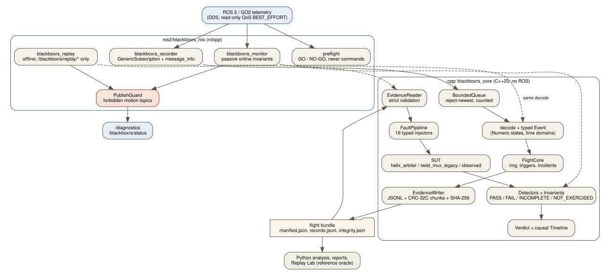
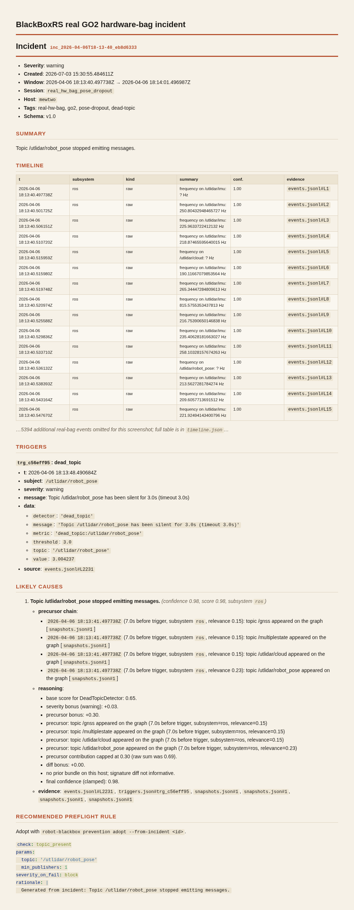
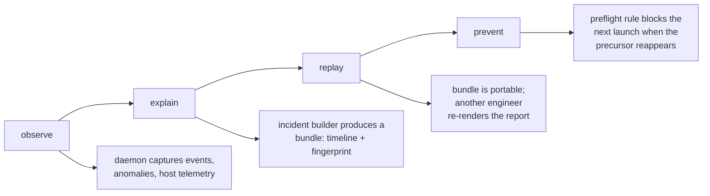
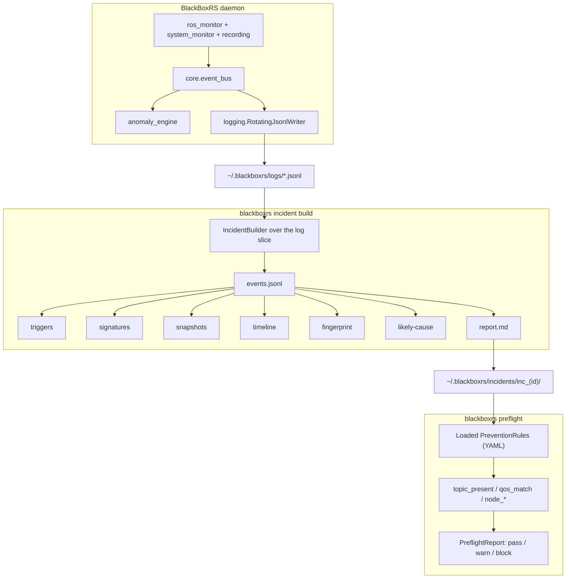

# BlackBoxRS

**A C++20 / ROS 2 reliability runtime for deterministic flight recording, incident replay, fault injection and safety regression testing on autonomous robots.**

[](https://github.com/yusufdxb/BlackBoxRS/actions/workflows/cpp.yml)


BlackBoxRS sits beside a robot's autonomy stack, never in its control path. It records what the robot was told and what it did, with bounded memory and explicit accounting of anything it could not keep. It replays that evidence deterministically, with injected faults, through the arbitration logic, and judges it against explicit safety invariants. The same C++ code runs online as a passive monitor and offline as a regression test.



| Component | What it is | Where |
|---|---|---|
| `blackboxrs_core` | ROS-free C++20 library: clock-domain types, typed events, bounded recording pipeline, evidence writer with integrity records, deterministic replay, 16 fault injectors, arbitration models, detectors and invariants | [`cpp/`](cpp/) |
| `blackboxrs` CLI | `replay`, `inject`, `verify`, `faults`, `inspect`, `validate`, `benchmark`, `synth-record`, `config`, `version` | [`cpp/tools/`](cpp/tools/) |
| `blackboxrs_ros` | rclcpp nodes: passive **recorder**, online **monitor**, offline **replay**, GO / NO-GO **preflight** | [`ros2/blackboxrs_ros/`](ros2/blackboxrs_ros/) |
| Python | the reference implementation the C++ engine is checked against byte for byte, flight analysis and reports, the incident-intelligence daemon (below) | [`blackboxrs/`](blackboxrs/) |

## Status

**Software ready for hardware validation. Not validated on the GO2 or the Jetson.** Everything below was measured on an x86_64 workstation, or off-robot beside HELIX's own rehearsal with a fake GO2. The first on-robot gates (build, then passive recording with no motion) are written out step by step in [docs/CPP_HARDWARE_VALIDATION.md](docs/CPP_HARDWARE_VALIDATION.md).

| Claim | Evidence |
|---|---|
| The C++ replay engine matches the Python reference | all 30 golden cases and 15 more fault combinations produce **byte-identical** result documents (verdict, every finding, invariant counts, causal timeline, text) in both engines; so do bundles written by the C++ recorder (`tests/cpp`) |
| The arbitration model is the deployed HELIX logic | 2,198 decisions of HELIX's own `arbiter_core.py` (40 streams: STOP, stale command, teleop vs STOP, NaN/Inf/over-limit, hold stream lost, restarted publisher ...) reproduced exactly (`test_helix_parity`) |
| Replay is deterministic | 100 replays of every golden case, separate processes, byte-identical (CI) |
| It records real stacks | beside HELIX's off-robot A-F rehearsal (real HELIX nodes, `helix_msgs` and `unitree` types decoded at run time) all six stages passed; 23,140 messages, 0 dropped, every bundle verified; the Python stop-chain report reads the C++ evidence (StopMove answered, stop 0.24 s on the fake GO2) |
| It is cheap and bounded | on real ROS traffic (real `unitree_go` LowState / SportModeState, Odometry) the recorder process used **2.8 % of one core at the GO2 rate** (946 msg/s), 17.7 % at 10x, with 0 drops and ~33 MB RSS at every scale |
| Nothing it runs can move the robot | the only publishers are `/diagnostics` and `/blackboxrs/...`; motion and control topics are refused before a publisher exists, including through remaps; checked on a live graph (`test_passive_nodes`) |
| Memory-safe, race-free, UB-free under test | ASan, UBSan and TSan runs of every test in CI; clang-tidy with zero warnings |

It found a real bug on the way: replaying the HELIX rehearsal showed the `fresh_output` invariant (in the Python reference and the port alike) reporting a stale command when a navigation command changed between an arbiter publication and the next tick. The fix, the regression cases and the story are in commit `cb5f7f4` and [docs/REPLAY_LAB.md](docs/REPLAY_LAB.md).

## Build

Ubuntu 22.04, GCC 11+ (C++20), CMake 3.22, ROS 2 Humble for the nodes.

```bash
sudo apt-get install -y ninja-build nlohmann-json3-dev libyaml-cpp-dev libgtest-dev libssl-dev
cmake -S cpp -B cpp/build/release -G Ninja -DCMAKE_BUILD_TYPE=Release && cmake --build cpp/build/release
ctest --test-dir cpp/build/release                         # core: unit, integration, parity with HELIX
source /opt/ros/humble/setup.bash
colcon build --base-paths cpp ros2 --cmake-args -DCMAKE_BUILD_TYPE=Release   # + the ROS 2 nodes
pip install -e ".[dev]" && pytest tests/cpp                # Python vs C++ differential tests
```

## Replay, inject, verify

Every command in this block is run by `tests/cpp/test_readme_commands.py`, which checks the exit code in the comment (0 PASS, 1 FAIL, 3 INCOMPLETE / unverifiable, 4 DETECTED).

<!-- cli:start -->
```console
$ blackboxrs verify examples/replay_lab/cases --repeat 100                       # exit 0
$ blackboxrs replay examples/replay_lab/cases/nominal_motion.json --no-timeline  # exit 0
$ blackboxrs replay examples/replay_lab/evidence/nominal_motion --sut twist_mux_legacy --inject drop:topic=/nav/cmd_vel,from_s=4.0   # exit 1
$ blackboxrs inject examples/replay_lab/evidence/nominal_motion --fault drop:topic=/nav/cmd_vel,from_s=4.0 --no-timeline   # exit 4
$ blackboxrs replay examples/replay_lab/cases/clean_stop.json --speed 10 --no-timeline    # exit 0
$ printf 'q\n' | blackboxrs replay examples/replay_lab/cases/clean_stop.json --step      # exit 0
$ blackboxrs faults                                                              # exit 0
$ blackboxrs inspect examples/replay_lab/evidence/clean_stop                     # exit 0
$ blackboxrs validate examples/replay_lab/evidence/clean_stop                    # exit 3
$ blackboxrs synth-record --out "$WORK/synth" --seconds 2                        # exit 0
$ blackboxrs validate "$WORK"/synth/inc_*                                        # exit 0
$ blackboxrs config configs/go2_hardware.yaml                                    # exit 0
$ blackboxrs benchmark --only replay --json "$WORK/bench.json"                   # exit 0
$ blackboxrs version                                                             # exit 0
```
<!-- cli:end -->

A stale command through the legacy mux, and what the causal timeline shows (abridged):

```console
$ blackboxrs replay examples/replay_lab/evidence/nominal_motion --sut twist_mux_legacy --inject drop:topic=/nav/cmd_vel,from_s=4.0
fault     F1 drop(every_n=1, from_s=4.0, topic=/nav/cmd_vel) -> 40 event(s)

invariants
  NOT_EXERCISED consistent_state
  PASS          finite_output
  FAIL          fresh_output  first at +4.520s, 75 violating tick(s)
  NOT_EXERCISED stop_dominance
...
  T0011   +3.953s  INPUT     /nav/cmd_vel command (0.150, 0.000, 0.000)
  T0012   +4.003s  FAULT     fault F1 drop (every_n=1, from_s=4.0, topic=/nav/cmd_vel): 40 event(s) affected
  T0013   +4.460s  DECIDE    arbitration SILENT (time-driven, no new input): no live input, nothing is published, the robot-facing sink keeps (0.150, 0.000, 0.000)
  T0014   +4.520s  DETECT    [warning] command_source_stale /nav/cmd_vel: ... silent 0.567 s (window 0.5 s)  <- T0011  [related fault: F1]
  T0015   +4.520s  INVARIANT [critical] stale_command_forwarded robot_output: robot-facing command [0.15, 0.0, 0.0] is not backed by a fresh valid source message  <- T0009, T0011  [related fault: F1]

VERDICT   FAIL: invariant(s) violated: fresh_output
```

The same fault through the HELIX arbiter model ends in DETECTED: the source goes stale, the arbiter publishes zero, and the invariant holds. The fault injectors, invariants and verdicts are described in [docs/REPLAY_LAB.md](docs/REPLAY_LAB.md).

## On a robot (passive)

```bash
ros2 run blackboxrs_ros preflight --config configs/go2_hardware.yaml        # GO / NO-GO, never moves anything
ros2 launch blackboxrs_ros recorder_monitor.launch.py config:=$PWD/configs/go2_hardware.yaml
# Ctrl-C: stop intake, drain, finalize every bundle, join, exit 0
blackboxrs validate ~/blackboxrs_evidence/<session>/inc_*
blackboxrs replay ~/blackboxrs_evidence/<session>/inc_* --sut observed
```

The recorder, monitor and preflight executables are run on a live ROS graph by `ros2/blackboxrs_ros/test/test_passive_nodes.cpp` (including SIGINT during recording and an invalid configuration starting nothing).

## Performance (workstation, measured)

x86_64, 24 logical CPUs, Release build. **Not the Orin NX**: the Jetson numbers are measured at gate H0/H1. Raw data in [docs/benchmarks/](docs/benchmarks/), method in [docs/CPP_BENCHMARKS.md](docs/CPP_BENCHMARKS.md).

Recorder process on real ROS 2 traffic (real `unitree_go` and `nav_msgs` types, real CDR decode, `go2_helix` profile, continuous capture with fsync), 30 s per row:

| Load | Offered | Received | Dropped | Recorder CPU (one core) | Peak RSS | Evidence |
|---|---|---|---|---|---|---|
| 1x GO2 | 946 msg/s | 28,382 / 28,382 | 0 | 2.8 % | 32.8 MB | verified |
| 2x | 1,892 msg/s | 56,762 / 56,762 | 0 | 4.5 % | 32.8 MB | verified |
| 5x | 4,730 msg/s | 141,902 / 141,902 | 0 | 10.0 % | 32.8 MB | verified |
| 10x | 9,460 msg/s | 283,802 / 283,802 | 0 | 17.7 % | 32.9 MB | verified |

For comparison, the Python flight recorder used 40.6 % of one core at 1x on the same workstation (with a slightly larger topic set, [docs/FLIGHT_RECORDER.md](docs/FLIGHT_RECORDER.md)) and about 98 % on the Orin NX. The C++ core also sustains 20x (20,720 msg/s) with 0 drops; a subscription callback spends under 0.6 µs median and 1.3 µs p99 handing a message to the queue; replay runs about 2,000x faster than real time.

## Engineering notes

* **Time.** Each clock (recorder monotonic, recorder wall, ROS, publisher source, replay) is its own `std::chrono::time_point` type; mixing them does not compile, and the replay clock has no `now()`. Ordering is `(t, origin, seq, copy)`, total and documented; equal keys are refused.
* **Ownership and threads.** Three threads with one owner each: the executor thread only stamps clocks and moves the executor's serialized buffer into a fixed-capacity ring queue (it never blocks, never decodes, never touches the disk); one pipeline `std::jthread` owns decoding, FlightCore and all bookkeeping; one writer `std::jthread` owns the disk. Shared state is two queues and atomic counters. `stop()` closes intake, drains to a deadline, counts what it could not drain, finalizes and joins; nothing is detached.
* **Bounded, never silent.** A full queue rejects the newest message and counts it against its topic. `received = processed + dropped_ingest + dropped_at_shutdown` is asserted under concurrent producers. Losses (full queue, DDS `message_lost`, shutdown) are kept by arrival time, so a bundle that lost anything inside its own window says `complete_with_loss`; one that could not be written, or whose writer stalled past 2 s, says `write_failed` and keeps its `.partial` name; a recorder pipeline that dies closes its bundle as `pipeline_failed` and exits 1. Both replay engines refuse every one of these, and any bundle whose `records.jsonl` disagrees with its `integrity.json`, unless partial evidence is explicitly allowed.
* **Evidence.** The existing flight-bundle format (so every Python tool reads it), plus `integrity.json`: record count, SHA-256 streamed while writing, and a CRC-32C chunk table that locates a flipped byte, a truncation or appended data. A mutex queue measured at 6-8 M pushes/s, over 300x the 20x load, so there is no lock-free queue.
* **Determinism across languages and architectures.** Floats are printed with Python's `repr` rules and compiled with `-ffp-contract=off` (no fused multiply-add on the aarch64 Jetson), which is what keeps replays byte-identical to Python and, at gate H0, across x86 and ARM.
* **Sanitizers.** ASan and UBSan with GCC; TSan with Clang 14, because GCC 11's TSan runtime does not intercept `pthread_cond_clockwait` and reports a false double lock inside `condition_variable_any`. A deliberate race is detected by the same setup.

Design: [docs/CPP_ARCHITECTURE.md](docs/CPP_ARCHITECTURE.md). Hardware plan: [docs/CPP_HARDWARE_VALIDATION.md](docs/CPP_HARDWARE_VALIDATION.md).

## Limitations

* No GO2 or Jetson result exists for the C++ runtime yet. The recorder's CPU on the Orin NX, the payload disk under fsync, and whether Cyclone supplies DDS source timestamps there are open until H0/H1.
* Not hard real-time. "Deterministic" means replay ordering, state transitions and evidence processing are a function of (evidence, build, configuration, faults). It says nothing about Linux scheduling of the live recorder.
* The arbitration models are models. `helix_arbiter` is checked against HELIX's own code; `twist_mux_legacy` against HELIX's measurements of twist_mux 4.3.0, not against the binary.
* The golden replay evidence is synthetic; the HELIX rehearsal evidence is real software on a fake robot. Neither is a physical-robot recording.
* `byte[]` (octet) arrays decode to lists of integers, where the Python recorder writes base64 per element; no profile topic uses them.

---

# Incident intelligence (Python daemon)

The rest of this README describes the Python incident-intelligence daemon, which shares the repository and the flight-bundle evidence.

When a ROS 2 robot misbehaves in the field, the honest answer to "what just happened?" is usually an afternoon of SSH, `journalctl`, and Slack archaeology. BlackBoxRS turns that afternoon into a paragraph.

It runs a lightweight daemon that watches the ROS 2 graph, host, and (optionally) an off-board observer. When a failure fires, one command builds a reproducible **incident bundle**: a timeline, the raw evidence, config and version signatures, a likely-cause narrative grounded in that evidence, and a preflight rule you can adopt so the same failure blocks the next launch instead of recurring on a different robot two weeks later.

The bundle is the artifact. Everything else is plumbing.

---

## The problem, concretely

A ROS 2 robot fails on a field test. Today that costs you:

1. Engineer SSHs in, runs `ros2 topic list`, scrolls `journalctl`, greps. Twenty to ninety minutes per incident.
2. Log fragments get pasted into Slack; three engineers reconstruct the timeline from memory.
3. The "fix" is a one-line config change with no record of *why*.
4. The same failure recurs on a different robot two weeks later, and nobody connects the two.

With BlackBoxRS the daemon is already running, so the failure is already captured:

```
robot-blackbox incident build --since 5m
# -> ~/.blackboxrs/incidents/inc_2026-05-07T14-22-00_a3f2/
#    ├── report.md
#    ├── incident.json
#    ├── timeline.json
#    ├── fingerprint.json
#    ├── signatures/{config.json, versions.json}
#    └── evidence/{events.jsonl, triggers.json, snapshots.json}
```

You read `report.md`. The likely cause is named with a confidence score, and every claim in it links straight to the evidence file that backs it (`events.jsonl#L11`, `triggers.json#trg_df6aa081`). One command converts the incident into a `PreventionRule`, and `robot-blackbox preflight` fires that rule before the next launch.

---

## It runs on real GO2 data

The offline replay path has been run against a genuine `rosbag2` recording from a physical Unitree GO2 (not simulation): `/utlidar/robot_pose`, `/utlidar/imu`, `/utlidar/cloud`, `/gnss`, `/multiplestate`, about 94k messages over a 330-second session. Played untouched, it replays clean end to end (zero anomalies), which is the point: the detectors aren't inventing failures. Inject a `/utlidar/robot_pose` dropout into an otherwise-real window and the real `DeadTopicDetector` finds it from bag timing alone.

One honest boundary: BlackBoxRS has **not** run in a closed control loop on a live robot. The loop it closes here is record-then-replay, off to the side of the robot's own stack. A live onboard capture during a real field failure is the one thing still owed (see [What's next](#whats-next)).

Reproduce it against your own recording (the source bag is ~680&nbsp;MB and is not checked in):

```
robot-blackbox replay-bag <path-to-your-rosbag2-dir> \
  --drop-topic /utlidar/robot_pose --drop-after 60 --timeout 3.0
```

The committed example trims that same recording to a 20-second window so the checked-in artifact stays small:

```
$ python scripts/generate_real_hw_bag_incident.py --bag /path/to/extended_5min
Dead topic detected: /utlidar/robot_pose silent for 3.0s
Real-hw-bag bundle: examples/incidents/inc_real_hw_bag_pose_dropout
  events=5439 topics=['/gnss', '/multiplestate', '/utlidar/cloud', '/utlidar/imu', '/utlidar/robot_pose']
  anomaly: /utlidar/robot_pose silent 3.0s @ 2026-04-06T18:13:48.490684+00:00
```

The incident report it generated:



Full bundle: `examples/incidents/inc_real_hw_bag_pose_dropout/`. Its sim-bag sibling (`inc_real_bag_odom_dropout/`) runs through the exact same code path.

---

## Where it runs

BlackBoxRS does not need to live on the robot.

| Mode | Where it runs | When to use |
|---|---|---|
| **Onboard** (default) | Same host as the ROS 2 graph (Jetson, NUC, on-robot workstation). | You have shell access and want host metrics (CPU, memory, per-process CPU/RSS) in the bundle. |
| **Observer** | Any workstation that can `ros2 topic list` against the robot over DDS. No SSH, no per-robot install. | You're debugging from a laptop, the robot's compute is locked down, or a whole team needs to capture bundles without each person installing a daemon on the robot. |

Observer mode is one config flag:

```yaml
# ~/.blackboxrs/config.yaml
runtime:
  role: observer
  observed_host: go2-edu-01     # free-form label, ends up in every bundle
```

The DDS-bound detectors keep working because they watch the robot's published graph. Host thresholds (CPU, memory) would describe the observer laptop rather than the robot, so the system-monitor pipeline that feeds them auto-disables, and `process_signals` disables with it. Every bundle records both `observer_host` and `observed_host`, so the report names the two sides instead of quietly conflating them.

All seven detectors ship live: `threshold`, `frequency`, `dead_topic`, `qos_mismatch`, `tf_topology`, `clock_skew`, and `process_signals`. See `docs/QUICKSTART_REMOTE.md` for the five-minute walkthrough from `pip install` to a first remote-captured bundle.

---

## The loop


```mermaid
graph LR
    O[observe] --> E[explain]
    E --> R[replay]
    R --> P[prevent]

    O --> Od["daemon captures events,<br/>anomalies, host telemetry"]
    E --> Ed["incident builder produces a<br/>bundle: timeline + fingerprint"]
    R --> Rd["bundle is portable;<br/>another engineer<br/>re-renders the report"]
    P --> Pd["preflight rule blocks the<br/>next launch when the<br/>precursor reappears"]
```

`observe` was the v0.3 wedge. `explain -> replay -> prevent` is what turns a recorder into a tool.

---

## A sample bundle

`examples/incidents/inc_demo_tf_break/` is a synthetic-but-realistic TF-break incident, committed to the repo and generated by real code. The top of its `report.md`:

```
# Incident `inc_2026-05-07T14-22-00_04ca9c43`

- **Severity**: error
- **Window**: 2026-05-07 14:22:00.000Z -> 2026-05-07 14:22:15.000Z
- **Session**: `demo_tf_break`
- **Host**: `dev-workstation`

## Summary

Topic /tf_static stopped emitting messages.

## Timeline

| t                          | subsystem | kind    | summary                        | conf. | evidence                  |
|----------------------------|-----------|---------|--------------------------------|-------|---------------------------|
| 2026-05-07 14:22:00.000Z   | ros       | raw     | frequency on /tf_static: 1.0Hz | 1.00  | events.jsonl#L1           |
| ...                        | ...       | ...     | ...                            | ...   | ...                       |
| 2026-05-07 14:22:08.000Z   | anomaly   | trigger | dead_topic on /tf_static       | 1.00  | triggers.json#trg_df6aa081 |

## Likely causes

1. **Topic /tf_static stopped emitting messages.** _(confidence 1.00)_
   - evidence: `events.jsonl#L11`, `triggers.json#trg_df6aa081`

## Fingerprint

- id: `fpr_68463b41f2ab8910`
- detectors: `DeadTopicDetector`
- subsystems: `anomaly`

## Recommended preflight rule

check: topic_present
params:
  topic: '/tf_static'
  min_publishers: 1
severity_on_fail: block
```

Read the whole thing without running anything:

```bash
robot-blackbox incident show examples/incidents/inc_demo_tf_break/
```

---

## What works today

- **Capture.** ROS 2 topic introspection and host telemetry feed seven anomaly detectors (`threshold`, `frequency`, `dead_topic`, `qos_mismatch`, `tf_topology`, `clock_skew`, `process_signals`), all with hysteresis (`min_consecutive_samples`, default 2) so a single noisy sample can't trip a false alarm. JSONL logging with size and age rotation; optional anomaly-triggered `rosbag2` recording. Measured FPR/TPR per detector is published in `docs/DETECTOR_CHARACTERISTICS.md`.
- **Incident bundles.** `IncidentBuilder` slices the JSONL log into a typed bundle: events, triggers, signatures, timeline, fingerprint, report.
- **Grounded reports.** Every claim in `report.md` resolves to a file in the bundle (`events.jsonl#Ln`, `triggers.json#<id>`). No orphan assertions.
- **Deterministic signatures.** sha256 over ROS distro, RMW, an env subset, attached files, and OS / Python / driver state. Same inputs, same hash.
- **Failure fingerprinting (v1).** A stable id from detector classes, subsystems, signature fields, and topic-set topology. Seed two bundles identically and they collide; perturb any input and the id moves.
- **Likely-cause ranking.** Detector-class weight plus a severity bonus. Confidence below 0.5 carries an explicit caveat; at or above 0.7 the cause is promoted to the summary. Weights are hand-calibrated (`blackboxrs/incident/cause.py:8-18`).
- **Prevention.** `PreventionRule` + `PreflightCheck` YAML I/O and a `PreflightRunner` with 0/1/2 exit codes (pass / block / warn). All seven check kinds are real: `topic_present`, `qos_match`, `node_running` are live rclpy graph queries; `env_var`, `param_value`, `resource_threshold`, `custom_python` run against `os.environ`, the ROS 2 parameter API, `psutil`, and a user-supplied import path. Unknown kinds raise at load time, never silently skip.
- **Observer mode, end to end.** `tests/integration/test_observer_live.py` boots a real rclpy publisher and asserts an observer-role daemon fires `anomaly.dead_topic` over DDS within 5s of the publisher going quiet, inside the Docker Humble CI job.
- **Offline bag replay.** `robot-blackbox replay-bag` replays a recorded `.mcap` or `.db3` through the real detectors, entirely offline, with a virtual clock pinned to bag time. It reads `.db3` split files (the chunks `ros2 bag record` produces on a long session) by merging every file `metadata.yaml` lists, not just the first one, a bug that had been silently dropping ~9% of messages.
- **GO2 flight recorder.** `robot-blackbox flight preflight / record / mark / replay / rehearse` is a passive, subscribe-only recorder for GO2 experiments: a declared topic profile (`go2`, and `go2_helix` for runs beside the HELIX motion arbiter), a rolling 10 s pre / 15 s post window around HELIX hold, STOP_AND_HOLD, arbiter forced-zero, node-death, staleness and manual triggers, a zero-motion GO / NO-GO preflight, and a report that rebuilds the HELIX stop chain (fault to odometry stopped) without mixing clock domains. Offline and live-DDS rehearsals use synthetic traffic and say so. See [`docs/FLIGHT_RECORDER.md`](docs/FLIGHT_RECORDER.md).
- **Replay Lab.** `robot-blackbox lab replay / verify / faults` replays a flight bundle on a virtual clock, injects deterministic faults (drop, gap, delay, duplicate, reorder, stale redelivery, clock skew, timestamp jumps, NaN/Inf/malformed values, frozen and stepped values, injected teleop streams), runs the motion-arbitration path (the recorded output, or a model of the HELIX arbiter or of legacy twist_mux) and checks four safety invariants: STOP dominance, finite output, fresh output, consistent arbiter state. Output is a causal timeline (input, detector, decision, robot-facing command) and a PASS / DETECTED / FAIL / INCOMPLETE verdict, byte-identical across runs. 28 golden cases pin down stale commands, NaN propagation, teleop overriding STOP, STOP losing arbitration, clock skew, telemetry dropout vs transport loss vs publisher crash, and more; they run in CI. The golden evidence is synthetic, and none of this is a physics simulation or a hardware result. See [`docs/REPLAY_LAB.md`](docs/REPLAY_LAB.md).
- **CLI.** `robot-blackbox incident build / show / list / attach`, `preflight`, `prevention adopt --from-incident / list`, `replay-bag`, `flight ...`, `lab ...`.
- **633 tests pass locally** with ROS 2 Humble sourced (1 skip: the optional `mcap` replay extra is not installed). Without rclpy, the rclpy-gated tests skip. CI runs lint + unit + integration on Python 3.10 / 3.11 / 3.12, a benchmark regression gate, a detector-FPR smoke run, and a live ROS 2 Humble Docker job on every commit to `main`.

## What's next

- **Live onboard capture.** The committed real-hardware evidence is offline replay of a real GO2 bag. A bundle captured live, on the robot, during an actual field failure is the single largest remaining gap and the next thing to land.
- **Cross-incident clustering.** `cluster_id` is already reserved on `FailureFingerprint`; targeted for v0.5.
- **`incident pack` / `unpack`** for portable tarballs.

Deliberately out of scope for now: a web dashboard and multi-host capture. Single-host first, and the bundle is the artifact. The bundle format is forward-compatible when multi-host arrives.

---

## Quick start

```bash
git clone https://github.com/yusufdxb/BlackBoxRS.git
cd BlackBoxRS
./setup.sh
source .venv/bin/activate

robot-blackbox init                    # 1. initialise
robot-blackbox start --foreground &    # 2. run the daemon (-f shows live output)
                                       # 3. ... your robot runs, anomalies fire and get logged ...
robot-blackbox incident build --since 5m                                    # 4. build a bundle
robot-blackbox incident show ~/.blackboxrs/incidents/inc_*                  # 5. read the report
robot-blackbox prevention adopt --from-incident ~/.blackboxrs/incidents/inc_*  # 6. adopt a rule
robot-blackbox preflight               # 7. next launch: the rule fires first
```

### Observer mode (from a laptop)

The steps above run the daemon on the robot. To capture incidents from a workstation that already sees the robot's topics over DDS:

```bash
# Robot on the same DDS domain (ROS_DOMAIN_ID and RMW_IMPLEMENTATION match).
ros2 topic list                        # must return the robot's topics

robot-blackbox init
cat > ~/.blackboxrs/config.yaml <<'YAML'
runtime:
  role: observer
  observed_host: go2-edu-01
YAML

robot-blackbox start --foreground &
# ... drive the robot, watch a failure ...
robot-blackbox incident build --since 5m
robot-blackbox incident show ~/.blackboxrs/incidents/inc_*
```

The bundle's `report.md` names both sides:

```
- **Observer**: `my-laptop`
- **Observed**: `go2-edu-01`
```

Host-bound collectors skip themselves automatically, because per-process CPU/RSS and host thresholds would describe the observer laptop rather than the robot. See `docs/QUICKSTART_REMOTE.md` for DDS setup, troubleshooting, and what each detector measures in observer mode.

---

## Architecture


```mermaid
graph TD
    subgraph Daemon["BlackBoxRS daemon"]
        Monitors["ros_monitor + system_monitor + recording"]
        EventBus["core.event_bus"]
        Anomaly["anomaly_engine"]
        Writer["logging.RotatingJsonlWriter"]
        Monitors --> EventBus
        EventBus --> Anomaly
        EventBus --> Writer
    end

    Logs["~/.blackboxrs/logs/*.jsonl"]
    Writer --> Logs

    subgraph Build["blackboxrs incident build"]
        Builder["IncidentBuilder over the log slice"]
        Events["events.jsonl"]
        Triggers["triggers"]
        Signatures["signatures"]
        Snapshots["snapshots"]
        Timeline["timeline"]
        Fingerprint["fingerprint"]
        Cause["likely-cause"]
        Report["report.md"]
        Builder --> Events
        Events --> Triggers
        Events --> Signatures
        Events --> Snapshots
        Events --> Timeline
        Events --> Fingerprint
        Events --> Cause
        Events --> Report
    end

    Logs --> Builder

    IncidentDir["~/.blackboxrs/incidents/inc_(id)/"]
    Report --> IncidentDir

    subgraph Preflight["blackboxrs preflight"]
        Rules["Loaded PreventionRules (YAML)"]
        Checks["topic_present / qos_match / node_*"]
        PReport["PreflightReport: pass / warn / block"]
        Rules --> Checks
        Checks --> PReport
    end

    IncidentDir --> Rules
```

See `docs/ARCHITECTURE.md` for the full system design.

---

## License

MIT. See `LICENSE`.

## Author

Yusuf Guenena ([yusufdxb](https://github.com/yusufdxb)).
