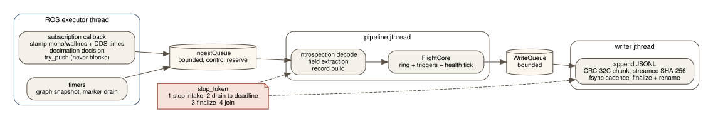

# BlackBoxRS C++20 runtime: architecture

This document was written before the C++ runtime was implemented, from an
audit of the repository at `feat/replay-lab-v1` @ `a85c369`. Section 9 lists
what changed while it was built. It says what the runtime is, what stays in
Python, and why the boundaries sit where they do.


## 1. Audit of the starting point

### Repository state

| Item | Value |
|---|---|
| Baseline branch | `feat/replay-lab-v1` @ `a85c369` (stacked on `feat/go2-flight-recorder` @ `318f4cc`, both pushed, no PR) |
| `main` | `c6dad94`, the merge base of every feature branch below |
| Tags | `v0.2.0`, `v0.3.0`, `v0.4.0`, `v0.4.1` (not moved by this work) |
| Baseline Python suite | 790 passed, 26 skipped (ROS-gated and `HELIX_SRC`-gated tests) |
| C++ on this line | none |

A second, unmerged branch, `feat/native-capture-plane` (24 commits on
`main`), holds a C++17 capture backend for the incident-intelligence daemon.
Section 8 covers how it relates to this runtime.

### Python architecture

BlackBoxRS has two lines that share a package:

* **Incident intelligence** (`blackboxrs/{core,ros_monitor,system_monitor,
  anomaly_engine,incident,prevention,recording}`, CLI `robot-blackbox start|incident|preflight`):
  a daemon that watches a ROS 2 graph, runs seven anomaly detectors, and ranks
  likely causes. This line is out of scope here.
* **Flight recorder and Replay Lab** (`blackboxrs/flight`, `blackboxrs/lab`,
  CLI `robot-blackbox flight ...` and `robot-blackbox lab ...`): the GO2 and
  HELIX safety-evidence line. This is what the C++ runtime implements.

The main parts of the flight recorder:

| Area | Current Python behaviour |
|---|---|
| Recorder (`flight/recorder.py`) | One rclpy node, subscriptions only, `BEST_EFFORT`/`VOLATILE`/`KEEP_LAST(200)`. The callback extracts profile fields, builds a JSON-ready dict and calls `FlightCore.ingest` on the executor thread. Graph polling and the health tick run on executor timers. A sampler thread reads system load. |
| Core (`flight/core.py`) | A ring buffer on the monotonic clock, bounded by `max_records`, `max_bytes` and the pre-trigger horizon. It fires triggers (hold asserted, recovery STOP, arbiter forced zero, node disappeared, topic stale, manual marker) and runs the incident lifecycle: one open bundle, secondary triggers attached, post window capped at 3x. |
| Bundle (`flight/bundle.py`) | A directory named `<id>.partial` holding `manifest.json` and an append-only `records.jsonl`, fsynced at least once a second. It is renamed to `<id>` on a clean close; `report.json` and `report.md` are written at close. One writer thread per bundle is fed by an **unbounded** `queue.SimpleQueue`. |
| Evidence format | JSON Lines. Each record carries `kind`, `seq`, `t_mono_ns`, `t_wall_ns`, `t_ros_ns`, `dds_src_ns`, `dds_rx_ns`, `pub_stamp_s`, `pub_stamp_domain` and `data` (the extracted fields). Non-finite floats are stored as the strings `"NaN"` and `"Infinity"`. There is no checksum, record count or end marker; completeness is inferred from the directory name and the manifest status. |
| Timestamps | Three recorder clocks (monotonic, wall, ROS) and up to three publisher-side times, each with a declared clock domain (`records.py`). Ordering is by recorder `seq`. |
| Shutdown | `core.shutdown()` closes an open bundle as `interrupted` and waits for writers. A kill leaves a `.partial` directory, which readers report as `interrupted_unfinalized`. |
| Preflight (`flight/preflight.py`) | Zero-motion checks (environment, evidence directory, clock, topic presence and types, QoS, nodes, a self-test bundle) giving GO / GO WITH WARNINGS / NO-GO. |

The main parts of Replay Lab (`blackboxrs/lab`, 28 golden cases over two
synthetic bundles):

| Layer | Behaviour |
|---|---|
| `evidence.py` | Strict loading. Refuses a torn, unfinalized or duplicate-`seq` bundle unless `allow_partial` is set, which caps the verdict at INCOMPLETE. |
| `events.py` | Total order `(t_ns, order)`. `order` is `(0, seq, sub)` for evidence events and fault-made copies, `(1, fault_index, k)` for synthesized events. |
| `clock.py` | Virtual clock that never moves backwards. Pacing is separate and cannot change a result. |
| `faults.py` | 16 deterministic injectors (transport, data, control). Every touched event is tagged with the fault id, and a fault that touches nothing is an error. |
| `sut.py` | The system under test: `observed` (recorded output) or a reference model (`helix_arbiter`, `twist_mux_legacy`), ticked at 50 Hz. |
| `monitors.py`, `liveness.py`, `transport.py` | Four invariants (`stop_dominance`, `finite_output`, `fresh_output`, `consistent_state`) and about twenty detectors. `liveness.py` reuses `FlightCore` triggers; `transport.py` reuses `flight.analysis.analyze`. |
| `engine.py`, `verdict.py`, `timeline.py` | Fixed dispatch order, stable finding and timeline ids, and PASS / DETECTED / FAIL / INCOMPLETE with exit codes 0, 4, 1 and 3. |

### Detector interfaces

The Python `Monitor` class has `on_event(e)`, `on_decision(d)`, `finish(t)`
and `invariants()`. Findings are frozen dataclasses with a total sort key.
Detectors and invariants live in the same objects: `CommandPath` owns
`finite_output` and `fresh_output` and also emits `command_source_stale`.

### HELIX integration points

* The deployed arbiter is pure Python: HELIX
  `src/helix_arbiter/helix_arbiter/arbiter_core.py`, byte-identical at
  `7d5bc14`, `5f474e5` (the build run on the payload computer on 2026-09-18)
  and `b31a9ce`. It has no ROS imports. Its API is `on_source`, `on_hold`,
  `decide` and `reset`, with `now` passed in on every call.
* Replay Lab's `helix_arbiter` preset is a re-implementation checked against
  that module on 20 seeded random streams (`test_helix_parity.py`, skipped
  without `HELIX_SRC`).
* Motion topics HELIX's own preflight treats as real (`preflight.py:49-50`):
  `/cmd_vel`, `/nav/cmd_vel`, `/teleop/cmd_vel`, `/helix/cmd_vel`,
  `/api/sport/request`, `/lowcmd`, `/wirelesscontroller`. `/helix/hold` can
  release a hold, so it is also a control topic.

### GO2 topic assumptions

From the measured field notes (`docs/go2_field_notes.md` on the capture-plane
branch, and the flight recorder profiles here): `/lowstate` 500 Hz,
`/sportmodestate` about 295 Hz, `/utlidar/imu` about 248 Hz,
`/utlidar/robot_odom` about 151 Hz, `/utlidar/cloud` about 15 Hz,
`/frontvideostream` about 29 Hz. The robot's own message stamps are
clock-skewed against the payload computer. No `/tf` and no `/cmd_vel`
publisher exist on a stock robot.

### Why the C++ work is needed

The one real payload measurement (2026-09-18, Orin NX, `go2_helix` profile,
no motion) found the Python recorder using **about 98 % of one core**. That is
a NO-GO under its own 50 % preflight budget, and it blocks the HELIX Stage E
capture, which needs `/lowstate` and `/sportmodestate`. A later
workstation-only change cut the synthetic load to 10.4 %, but that has not
been re-measured on the payload. Rate and gap findings from that session: 0
lost samples over 300 s, and about 66 ms gaps on the 500 Hz `/lowstate` that
were never explained.

## 2. What belongs in C++, and what stays Python

| Function | Where | Why |
|---|---|---|
| Live ingestion, bounded buffering, trigger core, evidence writing | **C++** | The hot path. It is CPU-bound on the payload and needs bounded memory and explicit drop accounting. |
| Typed event model, time model, evidence reader and validator | **C++** | Shared by recorder, monitor and replay. |
| Deterministic replay, fault injection, reference arbitration models, invariants, detectors, verdict | **C++** | Same code online (monitor) and offline (replay). This is the reliability-critical logic. |
| ROS 2 nodes (recorder, monitor, replay, preflight) | **C++** (rclcpp) | Hardware-facing. |
| Flight report analysis (`flight/analysis.py`), markdown rendering, benchmark plotting, fixture generation | Python | Offline post-processing. It reads C++ evidence directly because the format is shared. |
| Replay Lab (`blackboxrs/lab`) | Python, **frozen as the reference implementation** | The differential oracle for the C++ port. |
| Incident-intelligence daemon | Python, untouched | A different product line. |

Python modules that must not change until parity tests exist:
`blackboxrs/lab/*`, `blackboxrs/flight/{core,bundle,records,profile,analysis,replay}.py`,
the golden cases and evidence in `examples/replay_lab/`, and the generator
`scripts/generate_replay_lab_evidence.py`. The C++ work does not edit them.

## 3. Package layout

```
cpp/                         blackboxrs_core: C++20 library, no ROS dependency
  include/blackboxrs/        public headers
  src/                       implementation
  tests/                     GoogleTest unit and integration tests
  bench/                     benchmark harness (the `blackboxrs benchmark` command)
  tools/                     the `blackboxrs` CLI
ros2/blackboxrs_ros/         ament_cmake package: rclcpp nodes and preflight
configs/                     runtime configurations (go2_hardware.yaml)
tests/cpp/                   Python differential tests: Python Replay Lab vs C++
scripts/cpp/                 parity, determinism and benchmark drivers
```

`cpp/` is a plain CMake project and also a colcon package (`build_type
cmake`). It installs an exported target `blackboxrs::core`, which the ROS
package imports with `find_package(blackboxrs_core)`. The core therefore
builds and tests with no ROS installed (CI, sanitizers, a laptop), and the ROS
package adds only the rclcpp layer.

The Python package stays at `blackboxrs/`. Moving it to `python/` would break
every import, entry point and test for no engineering gain.

## 4. Core design

### 4.1 Time model (`time.hpp`)

Each clock domain is a distinct `std::chrono::time_point` over a tag clock,
so mixing domains does not compile:

| Domain | Type | Meaning | Has `now()` |
|---|---|---|---|
| recorder monotonic | `MonoTime` | `CLOCK_MONOTONIC` on the recorder host; never jumps | yes (`steady_clock`) |
| recorder wall | `WallTime` | `CLOCK_REALTIME` on the recorder host | yes |
| ROS | `RosTime` | the node clock (sim time when `use_sim_time`) | from rclcpp only |
| publisher source | `SourceTime` | DDS `source_timestamp`, the publisher host's wall clock | no |
| replay | `ReplayTime` | ns from the start of the evidence on the receipt clock | **no** |

`ReplayTime` has no `now()`, so replay code cannot read a clock by
construction. Conversions between domains are named functions that take the
anchor explicitly (for example `to_replay(MonoTime, MonoTime t0)`). A missing
timestamp is `std::optional`, never zero. The publisher-embedded stamp
(`pub_stamp_s`) keeps its declared domain string, as in Python.

Tie-breaking, which is also documented in the code and tested:

1. Replay order is `(t, origin, a, b)`. Evidence events and their fault copies
   have `origin = 0`, `a = seq`, `b = copy index`. Events synthesized by a
   fault have `origin = 1`, `a = fault index`, `b = generation index`.
2. Two events with the same key are an evidence error. Replay never guesses.
3. At one instant every event is delivered before the arbitration tick.
4. Within an event, handlers run in a fixed order: timeline, SUT, monitors,
   liveness. Within a tick: SUT, timeline, monitors, liveness.
5. Timestamp regressions, clock jumps and offsets are detected by comparing
   receipt and source time per topic against a per-topic baseline. They never
   reorder the stream.

### 4.2 Event model (`event.hpp`)

An `Event` is a value type: replay time, order key, event id, the fault ids
that touched it, and a `std::variant` body:

* `MessageEvent`: topic, `Role` (an `enum class` of the 19 profile roles),
  type name, publisher times, and a typed payload
  `std::variant<VelocityCommand, HoldState, ArbiterStatus, Odometry,
  RecoveryAction, OpaquePayload>`. Numeric fields are `Numeric` values with an
  explicit state (`ok`, `nonfinite`, `malformed`). Flags and integers carry the
  same distinction, so a malformed field is data, not an exception.
* `GraphEvent`, `MarkerEvent` and `SysEvent` for the other input record kinds.

The recorded payload (the evidence bytes, as JSON) is kept beside the typed
view as an immutable `shared_ptr<const Json>`. It is the durable form, like a
serialized CDR buffer. Detectors, invariants and arbitration models read only
the typed view. One function (`decode_payload`) owns the mapping from payload
to type, so the Python rules (`as_number`, bool is never a number, `"NaN"`
strings) are implemented once and tested once. A data fault is defined on the
payload path it changes (that is what its evidence record states), and the
typed view is decoded again from the changed payload.

### 4.3 Bounded recording pipeline



* `BoundedQueue<T>` uses a mutex and a condition variable, with fixed
  capacity, `try_push` that never blocks the producer, `pop_until` with a
  deadline, and `close()`. It counts depth, high-water mark, pushes and
  rejections. Control items (graph snapshots, markers, shutdown) have a
  reserved share of capacity, so data overload cannot starve them.
* Overflow policy: **reject newest, count it, never silently.** Every
  rejected item increments a per-topic `dropped_ingest` counter, which goes
  into the manifest and the diagnostics. A lost message (full queue, DDS
  `message_lost`, dropped at shutdown) is also entered in a loss ledger at its
  arrival time; a bundle whose window (pre-trigger window plus one second, to
  close) contains a loss closes as `complete_with_loss` with the count.
* The ROS callback only stamps clocks, decides store-rate decimation and
  moves the `shared_ptr<SerializedMessage>` into the queue. There is no copy of
  the payload by BlackBoxRS on the hot path. rmw has already copied it out of
  DDS once; that copy is not avoidable with `GenericSubscription`, and this
  document does not claim zero-copy.
* The lock-free question is decided by measurement: `BoundedQueue` is
  benchmarked under contention at 1x, 2x and 5x of the measured GO2 rates.
  It stays a mutex queue unless it measurably limits throughput.

### 4.4 Threading model

| Thread | Owner | Inputs | Outputs | Sync | Shutdown | On failure |
|---|---|---|---|---|---|---|
| ROS executor | node | DDS | `IngestQueue` | queue mutex | executor cancel | a callback never throws (try/catch, error counted) |
| pipeline | `Recorder` (`std::jthread`) | `IngestQueue` | `WriteQueue`, metrics | queue mutex and cv, `stop_token` | stop requested: drain to the deadline, then count the rest as `dropped_at_shutdown` | an exception is caught at the thread boundary: state `failed`, the queue closes, everything unprocessed is counted as dropped, the open bundle closes as `pipeline_failed`, and the node reports ERROR and exits 1 |
| writer | `EvidenceWriter` (`std::jthread`) | `WriteQueue` | files | queue mutex and cv | drains fully, then finalizes | an I/O error or an exception puts that bundle in `write_failed`; a hand-off that waits longer than `stall_timeout` (2 s) is counted against its bundle, which then closes as `write_failed` ("writer stalled"); nothing is dropped silently |

The monitor node runs detectors on its executor thread, because they are
O(1) per event and must not reorder events. Diagnostics are published from
the same thread on a timer. There are no detached threads and no global
mutable state; every thread is a `std::jthread` member whose destructor
requests stop and joins.

### 4.5 Evidence format

The existing flight-bundle layout is kept, so every Python consumer
(`flight replay`, `flight/analysis.py`, Replay Lab) reads C++ evidence
unchanged, and C++ reads the frozen Python fixtures unchanged:

* `records.jsonl`: the same record schema, byte-compatible field names and
  encodings.
* `manifest.json`: the same schema, plus `"writer": {"implementation":
  "blackboxrs-cpp", "version", "git_sha", "build_type"}` and a `"config_sha256"`.
* **New:** `integrity.json`, written last, before the rename. It holds the
  record count, first and last `seq`, first and last `t_mono_ns`, the byte
  length and SHA-256 of `records.jsonl` (streamed while writing, so nothing is
  re-read at close), and a chunk table: every 1024 records or 1 MiB, the byte
  offset, length, record count and CRC-32C. `blackboxrs validate` uses it to
  detect and locate truncation, bit flips and missing tails.

A custom binary format was considered and rejected for now. JSON Lines
already carries the typed field extraction, and Python tooling depends on it.
The measured bottleneck was Python CPU, not bytes on disk. A binary format
would need its own reader in Python before any existing analysis could use
it. If benchmarks show JSON encoding cost matters on the Orin NX, the
integrity layer carries over unchanged.

### 4.6 Replay

`EvidenceReader -> normalize -> FaultPipeline -> ReplayScheduler -> SUT ->
monitors, liveness, transport -> Verdict and Timeline`. It is a port of
`blackboxrs/lab` with the same semantics, checked by the differential tests
in section 6. Pacing (`--speed`, `--step`) is a separate object that is
handed the virtual step and may sleep. It cannot change a result, and a test
proves that.

### 4.7 Detectors and invariants

Detectors emit typed `Finding` values (time, monitor, kind, severity,
subject, evidence event ids, optional invariant). Invariants are separate
`InvariantState` objects with the four-valued status `PASS`, `FAIL`,
`INCOMPLETE`, `NOT_EXERCISED`. A missing observation is never PASS. The C++
names and semantics match Python exactly, because the parity test compares
them.

### 4.8 Safety posture (hardware-facing)

* The recorder and monitor create no publisher on any topic except
  `/diagnostics` and `/blackboxrs/...`. `PublishGuard` is the only factory for
  publishers in the ROS package. It refuses the motion topics above, anything
  outside the allowlist, and any topic in the configured forbidden list. A
  test inspects the live graph to confirm that.
* The replay node publishes only under `/blackboxrs/replay/...`, and only
  with `--publish` / `publish: true`. It refuses to start if a replay output
  name resolves to a forbidden topic after remapping.
* Every node logs its mode at startup (`RECORD (passive)`, `MONITOR
  (passive)`, `REPLAY (offline)`). A malformed configuration is fatal before
  any subscription is created.

## 5. Configuration

A runtime configuration (`configs/*.yaml`, `schema: blackboxrs.runtime.v1`)
names the capture profile, queue sizes, drain deadline, evidence directory,
disk floor, diagnostics, monitor thresholds and the forbidden-topic list. It
is validated at startup: unknown keys, out-of-range values and missing
required keys are errors. Its SHA-256 is recorded in every manifest.
`configs/go2_hardware.yaml` is the candidate for the first payload session.
It is **not validated on hardware**.

## 6. Parity and determinism plan

* **Replay parity:** every golden case, plus extra fault combinations, runs
  through Python Replay Lab and the C++ engine. The test compares verdict,
  invariant statuses and counts, the finding set (kind, severity, subject,
  time, evidence, invariant, related faults), fault injection logs, the
  decision stream, suppression counts and liveness message counts. Free text
  is not compared.
* **Arbiter parity:** the C++ `helix_arbiter` model is checked decision by
  decision against HELIX's own `arbiter_core.py`: live when `HELIX_SRC` is
  set, and always against frozen decision traces generated from that module
  at a pinned SHA.
* **Recorder core parity:** the same record streams go into Python
  `FlightCore` and C++ `FlightCore`; triggers, bundle boundaries and ring
  statistics must match.
* **Evidence round trip:** C++ write, C++ read, identical events. C++ write,
  Python `load_bundle` and `analyze` must succeed. Python fixture, C++ read,
  identical normalized stream.
* **Determinism:** 100 replays per critical case, with identical semantic
  digests.

## 7. Non-claims

* BlackBoxRS is not hard real-time. "Deterministic" means that replay
  ordering, state transitions and evidence processing are a pure function of
  (evidence, build, configuration, fault specification). It says nothing
  about Linux scheduling of the live recorder.
* No GO2 or Jetson result exists for the C++ runtime until the hardware gates
  in `docs/CPP_HARDWARE_VALIDATION.md` are run.

## 8. Relation to `feat/native-capture-plane`

That branch holds a C++17 MCAP capture backend for the incident-intelligence
daemon: a lock-free SPSC ring, a payload arena, raw CDR into MCAP segments,
and a rosbag2 exporter. It has never run on hardware and is not merged. It is
a different artifact: raw bytes for a bag-style archive, not the typed
flight-bundle evidence that Replay Lab and the HELIX stop-chain analysis
consume. This runtime does not merge it. What carries over is lessons, not
code:

* Its slow-writer scenario lost data because the writer re-read each segment
  to hash it at rotation. Here the hash is streamed.
* It had no TSan job. Here TSan runs on the concurrency tests.
* Its thread safety depended on a single callback group. Here the only state
  shared between threads is the queues and atomic counters.

Whether to merge the two backends later is an open decision for the
maintainer.

## 9. Changes during implementation

What the build changed relative to sections 1 to 8, and why.

* **Continuous capture mode (C++ only).** The Python recorder writes bundles
  only around triggers. The passive hardware gates need whole-session
  evidence, so the C++ recorder adds `capture.mode: continuous`: one bundle
  from the first record to shutdown, with triggers attached as secondary.
  A continuous capture keeps no pre-trigger ring, because nothing can use one.
* **Statuses that can never read as complete.** `complete_with_loss` (messages
  lost before the core during the bundle) and `write_failed` (a record did
  not reach the disk; the directory keeps its `.partial` name). Python
  Replay Lab used to accept `write_failed` evidence as finalized, a latent
  defect in the reference; both engines now treat both statuses as partial
  (commit `7166acb`). The hostile review added `pipeline_failed` (the
  recorder pipeline died mid-capture) and `interrupted` (stopped before the
  post-trigger window ended) to the same list.
* **Integrity checked on load.** When a bundle has `integrity.json`, both
  engines' evidence loaders check the byte count, line count, SHA-256 and
  `complete` flag against `records.jsonl` before a replay, with identical
  messages; a mismatch is refused like any incomplete status.
* **Hostile-review fixes to the recorder.**
  - Losses are attributed to a bundle by the arrival time of what was lost
    (loss ledger, 100 ms buckets), not by a running total sampled when the
    trigger was handled. Losses in the pre-trigger window or while the
    trigger waited in the queue used to be missed.
  - Staleness ticks use the arrival time of the newest processed message
    while a backlog is queued. Ticks at "now" used to call a topic stale
    whose newer messages were only queued.
  - A continuous capture that cannot open its bundle (disk below the floor)
    fails the recorder instead of running without recording. In triggered
    mode a skipped incident is an ERROR diagnostic and makes the exit code 1.
  - Strings from the robot with invalid UTF-8 are replaced (U+FFFD) in
    manifests, as they already were in records; before, one such string
    threw inside the writer.
  - The bundle directory is fsynced before the rename that makes it final;
    a failed fsync of the session directory after the rename is counted.
  - Messages refused after stop are no longer counted as received; DDS
    `message_lost` counts as loss; graph snapshots and markers that are
    refused or never processed are counted.
* **`stop_dominance` needs an output.** A decision with no robot-facing
  command (nothing published yet) is not a check that the stop held; both
  engines skip it, so a hold with no command after it is INCOMPLETE. The
  online monitor applies the offline INCOMPLETE gates in its diagnostics
  (no output observed, no command source seen, hold without a check).
* **Integrity chunk table streamed to disk.** A profile of the 5x soak found
  the recorder's only growing allocation: the open bundle's chunk table, one
  48-byte entry per 1,024 records held in a vector for the bundle's whole
  life (a continuous capture: the whole session). Completed entries are now
  appended to `integrity.chunks.tmp` in the bundle directory and
  `integrity.json` is assembled from it at close, byte-identical to before;
  the spool file is removed before the rename. RSS over 30 minutes at 5x is
  now flat after warmup ([CPP_BENCHMARKS.md](CPP_BENCHMARKS.md), section 4).
* **Held output (model assumption, not changed).** Between two recorded
  output messages the `observed` system under test takes the last command
  as still in effect at the robot, as a sink that keeps its last command
  does. If the robot's own command timeout zeroes it earlier, a judged
  nonzero output after a hold can be a false violation, never a false pass;
  the assumption is stated here rather than guessed per robot.
* **Profile bounds.** Every positive profile value must be finite and at
  most 1e9 (1e12 for `max_bytes`), in both parsers; `store_max_hz` is
  refused on trigger roles, whose decimated messages would not be decoded.
* **`fresh_output` specification change.** Replaying the C++ recording of
  HELIX's off-robot rehearsal showed the invariant, in the Python reference
  and in the port, reporting a stale command when a navigation command
  changed between an arbiter publication and the next tick. A replaced
  source message now backs an output for `fresh_grace_s` (50 ms) after it
  was replaced; longer than that is still a violation. Both engines
  changed identically; two golden cases pin it (commit `cb5f7f4`).
* **Recorder memory.** Measured on real ROS traffic, peak RSS grew with the
  message rate (51 MB at 1x, 206 MB at 10x) because every ring entry kept
  its decoded JSON tree. Payloads are now released once triggers are
  evaluated: 33 MB at every scale, CPU unchanged (commit `50db5a1`).
* **No floating-point contraction.** Everything is compiled with
  `-ffp-contract=off`. aarch64 has fused multiply-add, and a contracted
  `a*b+c` rounds once where CPython rounds twice; replays must stay
  byte-identical to Python and across architectures.
* **Float printing.** nlohmann's Grisu2 output is round-trip-safe but not
  always shortest (`0.5669190120000001` instead of `0.566919012`), which
  broke byte-identity with Python. The runtime writes JSON with its own
  emitter: shortest digits from `std::to_chars`, laid out by CPython's
  `repr` rules.
* **Queue.** The mutex-and-condition-variable ring queue was benchmarked at
  6 to 8 million pushes per second with 1 to 4 producers, over 300x the
  20x GO2 stress load. No lock-free queue was written.
* **TSan.** GCC 11's TSan runtime does not intercept
  `pthread_cond_clockwait`, which libstdc++ uses for `steady_clock` waits,
  and reports a false double lock inside `condition_variable_any`. TSan runs
  with Clang 14, whose runtime intercepts it; on Linux 6.x kernels the tests
  run under `setarch -R` (the older TSan runtimes abort on 32-bit mmap
  randomization). A deliberate race is reported by the same setup.
* **Provenance keys.** The C++ manifest's session block uses the Python
  recorder's key names, so the Python flight report shows the host and the
  build of C++ evidence.
* **Online monitor scope.** The monitor node runs the invariants and the
  command-path, clock and odometry detectors live. Staleness of periodic
  telemetry is left to the recorder's own `topic_stale` trigger, so it is
  not computed twice.
* **Decoder difference.** `byte[]` (octet) sequences decode to lists of
  integers; the Python recorder writes base64 per element. No profile topic
  has such a field.
* **Layout.** As planned in section 3; the Python package stays at
  `blackboxrs/`.
