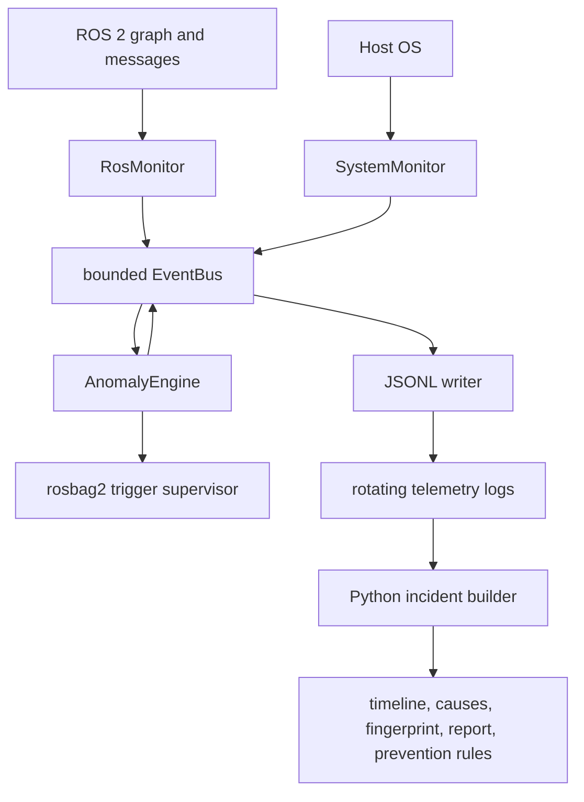

# Native Capture Audit

## Purpose and proof boundary

This audit maps the BlackBoxRS capture path immediately before a native recorder was introduced. It identifies the contracts that must be preserved, the limits that motivate a C++ capture plane, and the Python responsibilities that should remain unchanged. It is intentionally a baseline audit rather than a description of the later native implementation.

The findings are based on source, tests, configuration, CI, committed fixtures, generated incident bundles, and local validation at commit `55e50f4`. Static inspection does not prove live robot behavior, sustained high-rate DDS capture, disk-pressure behavior, or hardware-specific performance.

## Current system

BlackBoxRS 0.4.1 is a Python package, not currently an `ament` workspace. One daemon process coordinates several thread-owning components through an in-process `EventBus`:



The daemon starts the JSONL logger first, then the anomaly engine, optional rosbag2 recorder, ROS monitor, system monitor, and optional Prometheus exporter. It stops them in reverse order. Producers therefore stop before the two primary consumers, but the consumers do not drain their remaining queues during shutdown.

### Runtime roles

The public runtime roles are:

- `onboard`: ROS graph monitoring and host telemetry run on the robot host.
- `observer`: DDS-visible ROS monitoring runs offboard. `apply_runtime_role()` disables the system monitor so local CPU, memory, disk, GPU, and process data are not mislabeled as robot data. Incident bundles carry `observer_host` and `observed_host`.

The native recorder should preserve the same role distinction without assuming a specific processor, GPU, device path, RMW implementation, or network topology. Generic DDS evidence capture is meaningful in either role. Local process and disk-health evidence must continue to identify which host it describes.

### Configuration boundary

The pre-native configuration is a nested dataclass tree loaded from YAML. Missing keys use defaults, unknown keys warn by default, and strict loading rejects them. Capture-relevant defaults are:

| Concern | Baseline configuration | Architectural implication |
|---|---|---|
| Event fan-out | `event_bus_queue_maxsize: 1024` | Bounds each subscriber by object count, not bytes |
| ROS graph sampling | `poll_interval_sec: 1.0` | Discovery and churn evidence is sampled at one-second resolution |
| Generic topic filter | empty `topic_filters` | All discoverable topics are candidates, subject to runtime type resolution |
| JSONL retention | 50 MiB per file, 20 files, no age limit | Nominal retained telemetry is about 1 GiB, excluding oversize-record behavior |
| System telemetry | one-second interval | Appropriate for health context, not a high-rate capture path |
| Dead-topic timeout | 5 seconds | Detector behavior depends on sampled frequency events and later heartbeat events |
| TF snapshots | 1 Hz, 60-second dynamic-edge garbage collection | Semantic TF state is deliberately lower-rate than raw `/tf` traffic |
| Process snapshots | one-second sampling, at most 64 matching processes | Payload cardinality is bounded, but matching and detector maps remain Python state |
| Triggered rosbag2 | disabled, 30-second post-trigger duration, at most 10 recordings | Compatibility recorder is opt-in and has no pre-trigger history |

There is no capture-backend selector, capture memory ceiling, payload-size limit, segment budget, post-trigger byte cap, queue-watermark policy, or recorder-level drop ledger in this baseline. Those are additive native-plane configuration contracts. Existing keys, detector thresholds, observer-role behavior, rosbag2 settings, and Python defaults should remain stable unless a versioned migration is provided.

## Existing capture contracts

### Unified Python event envelope

`BlackBoxEvent` is the live and JSONL envelope:

```json
{
  "timestamp": "UTC datetime",
  "source": "ros_monitor | system_monitor | anomaly_engine | rosbag_recorder",
  "event_type": "namespaced string",
  "severity": "debug | info | warning | error | critical",
  "data": {},
  "metadata": {}
}
```

The timestamp is a single wall-clock or process-global virtual-clock value. The schema has no monotonic timestamp, ROS timestamp, sequence number, payload bytes, capture backend, or evidence-quality fields. Its closed `source` literal also cannot represent a native capture source without either an additive schema change or an adapter that maps native records into current source values.

The principal emitted event families are:

- `ros.topology`, `ros.qos`, `ros.frequency`, and `ros.tf`
- `system.cpu`, `system.memory`, `system.disk`, `system.thermal`, `system.gpu`, `system.clock_skew`, and `system.process_signals`
- `anomaly.*` for the seven detector families
- `rosbag.recorder_*` and `rosbag.recording_*` lifecycle events

These names and their detector-facing payload fields are public internal contracts. A native adapter must preserve them for existing incident reconstruction unless a versioned migration updates every producer, detector, fixture, and reader together.

### ROS graph and topic monitoring

`RosMonitor` owns `/blackbox/blackbox_ros_monitor` and a `SingleThreadedExecutor`. Every configured polling interval, 1 second by default, it:

1. calls `get_topic_names_and_types()` and `get_node_names_and_namespaces()`;
2. queries publisher and subscriber endpoint information per topic;
3. emits full `ros.topology` and per-topic `ros.qos` snapshots;
4. dynamically subscribes to newly discovered topics;
5. destroys subscriptions and forgets frequency state when topics disappear.

Subscriptions resolve `pkg/msg/Type` to an installed Python message class at runtime and use best-effort, volatile, keep-last depth 1 QoS. The callback receives a deserialized Python message but discards its content, recording only a monotonic arrival timestamp in `FrequencyTracker`. A timer later emits sampled `ros.frequency` telemetry.

Consequences:

- The live Python path does not record serialized ROS messages or payload evidence.
- It requires the topic's message package to be importable even though no semantic deserialization is used.
- It pays rclpy deserialization and Python callback cost for every received message.
- One fixed subscription QoS is not a complete capture policy, especially for transient-local data.
- A topic that stays present but changes type is not resubscribed because subscriptions are keyed only by topic name.
- Multiple discovered types are reduced to the first returned type.
- Graph change time is quantized by the polling period. There are no native graph-event records or endpoint identities in the chronology.

`/tf` and `/tf_static` are exceptions. `TfSnapshotter` uses their required QoS profiles, deserializes `TFMessage`, stores the latest edges, and emits semantic `ros.tf` snapshots. Dynamic edges age out, while static edges are intentionally retained. This producer should remain a semantic Python input unless measurement shows that parsing TF in native code materially improves capture reliability.

### Seven detectors

All seven detectors are wired in the current engine:

| Detector | Input | State and current boundary | Native-capture relevance |
|---|---|---|---|
| threshold | host CPU, memory, GPU telemetry | two-sample hysteresis | Keep in Python; not a message-ingest bottleneck |
| frequency | sampled `ros.frequency` | learns ten samples per topic, then applies tolerance and hysteresis | Native rate counters can produce better telemetry; ranking stays in Python |
| dead_topic | `ros.frequency` plus any later event as heartbeat | last seen and alerted sets per topic | Native heartbeat is useful for prompt, deterministic triggers |
| qos_mismatch | endpoint QoS snapshots | compares publisher and subscriber policy pairs | Native graph telemetry can improve source fidelity; interpretation can remain Python |
| tf_topology | semantic `ros.tf` snapshots | detects multi-parent, orphan, and stale edges | Keep semantic analysis in Python unless profiling justifies otherwise |
| clock_skew | `system.clock_skew` snapshots | compares system, NTP, and optional `/clock` sources | Native capture must emit clock-jump facts; higher-level diagnosis remains Python |
| process_signals | local process snapshots | per-process CPU/RSS hysteresis | Keep onboard-only collection and diagnosis in Python |

Detector state is not generally bounded by a configured byte budget. Frequency baselines, dead-topic state, and other per-subject maps can retain entries for a session after churn. This is acceptable for short telemetry sessions but is not a production flight-recorder memory contract.

### Bounded queues and loss behavior

Each EventBus subscription has a finite event capacity. The default is 1,024. The logger, anomaly engine, and rosbag2 recorder request `max(4096, 4 * default)`. Publishing uses `put_nowait()`, so a slow consumer does not block a producer.

That is a useful backpressure primitive, but it is not a complete capture budget:

- Capacity is measured in Python objects, not bytes. `BlackBoxEvent.data` and metadata have no size limit.
- `FrequencyTracker` uses a time-window deque with no deterministic `maxlen`; a sufficiently fast burst between prune operations can grow it.
- TF static-edge storage and several detector topic maps have no configured hard cap.
- The same event is fanned out to independent queues, so the logger and detector can observe different subsets under pressure.
- Drop counters are keyed to a queue object, exposed only by `dropped_count(queue)`, and deleted on unsubscribe.
- Drops do not generate `BlackBoxEvent` records, are not exported by the current Prometheus component, and are not included in incident bundles.
- The only operational indication is a rate-limited Python warning. A later bundle cannot determine that its evidence was incomplete.

The existing benchmark honestly demonstrates this behavior: burst tests intentionally drop a large fraction of events while keeping the producer non-blocking. Those microbenchmarks use small synthetic telemetry events. They do not measure DDS ingestion, serialized payloads, multiple topics, large payloads, fsync, storage contention, CPU/RSS under long runs, or end-to-end capture latency.

### JSONL persistence

`LoggingPipeline` has one consumer thread and one `RotatingJsonlWriter`. The writer serializes each event with Pydantic, writes one line, and flushes the Python file object after every event. It rotates before a write would exceed the configured size and retains a configured file count. Defaults are 50 MiB per file and 20 files, with age-based retention disabled.

Current durability limits are:

- normal event writes are flushed but not fsynced;
- records have no per-record length, version, checksum, commit marker, or sequence number;
- a crash can leave a partial final line, which `LogReader` warns about and skips;
- writer exceptions are logged and the loop continues, but no recorder-fault event or durable loss summary is produced;
- a single event larger than the rotation limit can still create an oversized file;
- rotation and retention bound nominal disk use, not memory or incident-build memory;
- `LoggingPipeline.stop()` sets `_running` false before join, so queued events are abandoned rather than drained.

JSONL remains valuable as a human-readable telemetry and compatibility format. It is not a suitable high-rate serialized-payload store by itself.

### rosbag2 recording

The optional `Rosbag2Recorder` subscribes to anomaly events and supervises `ros2 bag record` as a separate process group. It supports topic selection, storage plugin selection, a fixed post-trigger duration, cooldown, a maximum number of recordings, and structured lifecycle events.

It provides standardized ROS payload capture and should not be discarded casually. Its present integration does not provide:

- pre-trigger history;
- capture active before the detector fires;
- a byte-bounded rolling buffer;
- per-topic or per-byte loss accounting integrated into the incident;
- trigger-to-flush latency metrics;
- native graph and clock events in the same ordered stream;
- storage-health state beyond subprocess lifecycle and exit status.

This is the concrete reason to evaluate a bounded native recorder rather than merely relabeling rosbag2. If rosbag2 or MCAP storage APIs provide the required serialized-message and crash-recovery primitives, the native implementation should use them and add only the missing bounded pre-trigger, trigger, graph, clock, and evidence-quality contracts.

## Incident intelligence that must remain in Python

The Python incident pipeline is substantially more mature than the capture path. `IncidentBuilder`:

1. selects a JSONL time window;
2. promotes anomaly events into typed triggers with evidence references;
3. projects system and ROS snapshots;
4. reconstructs raw and derived timelines;
5. collects config and version signatures;
6. computes a deterministic fingerprint;
7. ranks likely causes and recurrence context;
8. renders a grounded report and prevention recommendation;
9. stages, validates, manifests, and publishes the bundle.

These responsibilities, plus CLI UX, offline analysis, fingerprinting, reporting, recurrence, and prevention-rule generation, are not high-rate capture concerns and should remain in Python.

New bundles use a versioned manifest, file sizes, SHA-256 checksums, schema validation, a staging directory, and same-directory publication. This protects finalized incident artifacts from incomplete construction and accidental modification. It does not make the live JSONL stream durable, authenticate evidence, or reveal events that were dropped before bundle construction.

The builder materializes the entire selected event window into a list, sorts or copies it in several stages, and emits a full JSON timeline. This is appropriate for bounded incident windows but is another reason not to feed unbounded serialized payloads directly into `BlackBoxEvent.data`. A native reader should stream normalized metadata into the incident layer and expose payloads by stable evidence reference.

One current integration mismatch needs correction during interoperability work: `SystemSnapshotter` handles `ros.graph`, while the live monitor emits `ros.topology`. Topic state is also accumulated rather than replaced by each full graph snapshot. As a result, live node sets are not projected and topic disappearance cannot be reconstructed through this path even though `graph_deltas()` supports it when supplied synthetic snapshots.

The incident schema also lacks capture-quality metadata. It cannot currently report backend, received/committed/dropped counts, dropped bytes, highest queue use, storage errors, clock anomalies, or capture start/end. Those fields are required before Python can make confidence claims over native evidence.

### Prevention and preflight boundary

Prevention is downstream intelligence, not capture-plane work. The Python rule deriver validates a finalized incident bundle, requires a sufficiently confident evidence-linked hypothesis, and only auto-maps two detector classes: `DeadTopicDetector` to `topic_present`, and `QoSMismatchDetector` to `qos_match`. The resulting YAML rule retains incident, fingerprint, trigger, detector, and source-event provenance.

The preflight runner owns seven check kinds: `topic_present`, `qos_match`, `node_running`, `env_var`, `param_value`, `resource_threshold`, and `custom_python`. Active checks fail closed when execution is unavailable, malformed, or unknown, and the CLI distinguishes pass, block/error, and warnings through exit codes 0, 1, and 2. ROS graph checks create their own short-lived `rclpy` query node; host and custom checks remain Python integrations.

Native capture should improve the evidence supplied to rule derivation, including explicit incompleteness, but must not duplicate rule policy or preflight execution in C++. An incident with measured capture loss must carry that limitation into cause confidence and automatic-adoption decisions rather than presenting the same trust level as complete evidence.

## Offline replay and GO2 evidence

Offline replay reads topic names and recorded timestamps from MCAP or SQLite rosbag2 storage without deserializing payloads. It sorts all arrivals in memory, emits one `ros.frequency` event per arrival, pins the process-global virtual clock to bag time, and runs the real `DeadTopicDetector`. Fault injection can silence one topic after a cutoff. Only dead-topic replay is implemented; this is not a general replay of all seven detectors or message semantics.

The repository contains:

- a small committed MCAP fixture used in unit tests;
- a committed incident derived from a 20-second window of an externally held physical GO2 recording;
- an opt-in test that checks the untouched external recording contains more than 90,000 replayed messages over more than 300 seconds and produces no dead-topic anomaly;
- a fault-injected GO2 pose-dropout bundle containing the resulting telemetry, trigger, timeline, fingerprint, and report.

The full hardware recording is not in the repository and the opt-in test is skipped unless `BLACKBOXRS_REAL_BAG` is supplied. The local baseline therefore verifies the replay code and committed derived artifacts, not the original bag provenance or a live onboard capture. All committed example incident directories currently validate as readable legacy bundles because they predate `manifest.json`; their internal checksums are not independently verifiable through the new finalized-bundle contract.

This evidence is useful for Python compatibility testing. A small deterministic raw-bag fixture should be retained, and native-produced event metadata should be fed into the same incident pipeline. It must not be described as live robot capture.

## Current test and CI boundary

Local validation collected 596 tests. The result was 595 passed and one expected skip for the external real-GO2 bag. Ruff also passed.

Coverage is strong for Python schemas, event-bus queue limits and counters, all seven detectors, producer-to-detector paths, incident construction, integrity validation, replay, observer mode, PID safety, preflight checks, and CLI workflows. ROS Docker tests exercise a live rclpy publisher, dynamic discovery, frequency telemetry, topic filters, and observer dead-topic detection on ROS 2 Humble.

CI currently provides:

- Ruff and Python tests on Python 3.10, 3.11, and 3.12;
- a Python event-bus/writer benchmark regression gate;
- a synthetic detector-characteristics smoke run;
- Docker-based ROS 2 Humble live tests.

It does not currently provide C++ builds, GCC/Clang coverage, GoogleTest, sanitizers, fuzzing, payload interoperability, crash recovery, disk failure injection, high-rate DDS load, long-run RSS tracking, or ROS composition tests. Existing live tests verify telemetry observation, not lossless or loss-accounted payload recording.

## Capture bottlenecks and risks

Priority order for the native design:

1. **No message evidence on the live hot path.** The Python callback discards every payload after deserialization.
2. **Evidence loss is not incident-visible.** Per-consumer queue drops and writer faults do not reach durable evidence or capture-quality metadata.
3. **No deterministic byte budget.** Queue limits are event counts, while payload and several state containers remain size-unbounded.
4. **Shutdown can discard accepted events.** Logger and detector queues are not drained after SIGTERM begins.
5. **One wall-clock timestamp cannot preserve order across clock jumps.** Monotonic time is used for local calculations but not stored with events; ROS time is only embedded in specialized producers.
6. **Graph capture is sampled state, not event chronology.** Publisher and subscriber churn can occur between polls, and the incident snapshot event-name mismatch loses live node deltas.
7. **JSONL is not a crash-recoverable payload segment contract.** There are no record checksums, commit boundaries, or recovery metadata.
8. **Generic subscription is only partially generic.** Runtime Python message packages are required, type changes are not handled, and one QoS profile cannot cover every topic contract.
9. **Long-session state is not fully bounded.** Burst timestamp windows, static TF edges, and detector topic maps lack hard capacity budgets.
10. **Existing performance evidence is not comparable to native capture.** It measures small telemetry objects after DDS and excludes large serialized payloads, disk pressure, and sustained operation.

## Recommended architectural boundary

The native component should own only the bounded capture plane:

- configured generic serialized subscriptions;
- monotonic and ROS timestamps plus capture sequence numbers;
- graph and endpoint change facts;
- byte- and record-bounded buffering and payload storage;
- limited local triggers needed for pre/post capture;
- explicit backpressure state and per-topic drop accounting;
- durable segment append, rotation, recovery, and capture metrics.

Python should continue to own:

- semantic detectors unless native execution materially improves evidence capture;
- incident selection and construction;
- derived timelines and causal ranking;
- fingerprints and recurrence;
- reports and evidence presentation;
- prevention-rule derivation and preflight;
- offline scientific analysis and the existing CLI experience.

The interoperability seam should be a versioned Python iterator over normalized capture events, with payloads referenced rather than copied into large Pydantic dictionaries. The adapter must preserve current telemetry event names where possible and expose capture-quality records as first-class evidence. Existing JSONL input remains supported behind `capture.backend: python`; the native backend should not become the default until parity, boundedness, recovery, loss visibility, integration, real-bag compatibility, and measured throughput gates pass.

## Native promotion gates derived from the audit

The C++ backend is ready for opt-in deployment only when all of the following are demonstrated:

- a configured maximum memory formula covers headers, queues, payload pools, topic metadata, and writer staging;
- every rejected, overwritten, or uncommitted record is counted by topic and byte size, with a durable loss event when storage permits;
- ROS and monotonic timestamps survive forward and backward ROS-clock changes without reordering the capture chronology;
- SIGTERM drains within a configured deadline and reports anything abandoned;
- SIGKILL or power-loss truncation recovers all complete records up to the last valid boundary;
- disk slowdown and full-disk injection leave the executor responsive and the recorder explicitly degraded;
- generic topics do not require compile-time message types where ROS 2 supports serialized subscriptions;
- graph churn and topic type/QoS changes do not leak subscriptions or state;
- the Python adapter reproduces current incident triggers, evidence references, timelines, fingerprints, and reports on deterministic fixtures;
- observer and onboard modes remain distinguishable;
- matched Python-versus-C++ workloads produce machine-readable results with no invented performance claims;
- the existing Python suite, ROS live tests, and opt-in real-bag workflow continue to pass.

The architectural justification is therefore specific: C++ is warranted for bounded serialized ingestion, clocked chronology, backpressure accounting, and durable segment writing. It is not warranted as a rewrite of BlackBoxRS incident intelligence.

## Baseline validation performed

The following checks were recorded against pre-native commit `55e50f4`:

- Inventoried all source, docs, tests, CI, fixtures, examples, and build metadata.
- Traced daemon startup/shutdown, queues, ROS subscriptions, graph polling, TF handling, all seven detectors, JSONL writer/reader, rosbag2 supervision, offline replay, incident construction, bundle integrity, observer mode, process signals, preflight, benchmarking, and public CLI commands.
- Verified default configuration values by importing the dataclass tree.
- Ran a ROS 2 workspace inventory, which confirmed there was no existing `package.xml` or ROS 2 package.
- Ran `.venv/bin/ruff check .`: passed.
- Ran `.venv/bin/pytest --collect-only -q`: 596 tests collected.
- Ran `.venv/bin/pytest -q`: 595 passed, 1 skipped in 53.92 seconds.
- Ran `robot-blackbox incident verify --json` against every committed example bundle: all four were readable legacy bundles with missing-manifest warnings.
- Inspected the committed MCAP type, size, and checksum and traced the external-bag test gating. No physical robot or external full GO2 bag was available or exercised.
