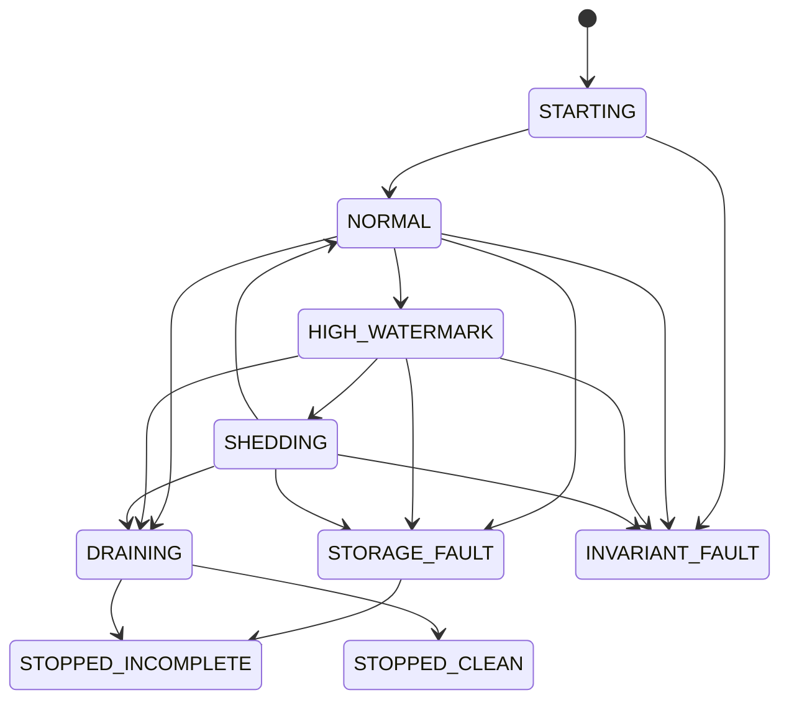

# Native capture failure model

## Safety objective

Capture failure must not indefinitely block the robot executor, grow memory
without a configured limit, or allow the incident layer to assume complete
evidence. The preferred degraded outcome is bounded loss with explicit scope,
timestamps, reason, and confidence impact.

The recorder distinguishes callback-received events from upstream DDS/RMW loss.
It can account exactly only after its callback begins.

## State model



Runtime storage faults are latched. The recorder does not return to `NORMAL`
after a writer fault; recovery of a partial file is a separate offline action.
Invariant faults are likewise sticky. Pressure-state updates and shutdown entry
cannot overwrite either fault before final status is emitted.

Control chronology can use reserved descriptor slots. Fixed per-topic and
per-reason ledgers remain authoritative if the reserve itself is exhausted.

## Failure contracts

| Failure | Required behavior | Evidence quality |
|---|---|---|
| Writer delay or blocked writer | Callback stays non-blocking, queue utilization rises, shedding walks the priority tiers from least to most important, then reject-newest is counted | Complete until the first accounted drop, degraded afterward |
| `ENOSPC`, `EIO`, or short write | Writer latches storage fault, closes admission, increments storage errors, attributes the remaining backlog to storage loss, and does not spin a crash loop | Incomplete after the last durable watermark |
| Payload larger than configured maximum | Reject before arena copy, consume a global sequence, count events and bytes by topic and reason | Explicit single-event gap |
| Descriptor or payload arena full | Reject newest data, preserve writer-owned oldest event, record count, bytes, sequence range, and time range | Explicit bounded gap |
| Control reserve full | Increment the sideband control-admission ledger even if a `DROP_EVENT` cannot enter the chronology | Degraded; sideband metadata is authoritative |
| Topic registry or string arena full | Do not create an untracked subscription; report registry exhaustion | Topic coverage incomplete |
| Malformed opaque CDR | Persist opaque bytes when storage accepts them; parser errors must not corrupt neighboring records | Semantic validity unknown for that record |
| Publisher death | Graph diff and configured dead-topic trigger use steady time; rotate and pin the incident window | Complete subject to normal loss counters |
| Publisher type, identity, or QoS churn | Reconcile observed graph state, assign a new ID for a type change, destroy stale subscriptions | Graph history is eventually consistent |
| ROS clock rollback or jump | Preserve steady ordering and emit a clock event with signed ROS evidence | Ordered chronology, anomalous ROS time |
| Wall-clock adjustment | No effect on ordering or deadlines | No evidence degradation |
| SIGTERM or SIGINT | Stop admission, drain queued work until the configured cutoff, close and sync, publish clean or incomplete state | Clean only if reconciliation and close succeed |
| SIGKILL or process crash | Leave `.partial.mcap`; recovery accepts only a valid prefix and marks unknown tail loss | Incomplete unless an earlier closed segment is used |
| Allocation failure at startup | Fail before subscriptions and report configuration/startup error | No session claimed |
| Runtime allocator failure outside pools | Enter explicit invariant or recorder fault, stop unsafe admission | Incomplete |

No writer failure may be translated to a successful close. No missing footer,
unresolved sequence gap, status timeout, or partial segment is interpreted as
zero loss.

Heartbeat and rate state observe callback arrival before payload admission.
Shedding, oversize rejection, arena exhaustion, and a full descriptor ring must
not make an active publisher look dead. Trigger intent has its own bounded writer
command queue when the chronology reserve cannot accept the trigger record. If
both paths reject it, `trigger_intent_lost` increments and an invariant fault is
latched.

## Deterministic injection

The writer configuration exposes delay and fail-after-byte controls for tests.
The lower-level writer interface also supports short-write, sync, and rename
faults. Injection settings must be present in the benchmark artifact and must not
be enabled in a normal deployment by accident.

Slow storage experiment:

```bash
python scripts/native_capture_benchmark.py --scenario G \
  --duration-sec 30 --output artifacts/native_slow_writer.json
```

The result is valid only if the recorder remains responsive, final status exists,
queue pressure is observable, and any loss is reconciled. A high drop count is a
valid overload result. A missing counter is an invalid experiment.

Disk-full testing should target a bounded temporary filesystem or an injected
`ENOSPC`, never the developer's real filesystem. The assertions are: no executor
deadlock, at least one storage error, incomplete capture status, and no claim of
durability past the failing barrier.

The benchmark supervisor can exercise the deterministic writer failure path:

```bash
python scripts/native_capture_benchmark.py \
  --scenario A \
  --fail-after-bytes 16384 \
  --expect-storage-fault \
  --output artifacts/native_storage_fault.json
```

`--expect-storage-fault` changes the experiment contract, not the recorder. The
artifact is valid only when `storage_errors` is nonzero, the terminal state is
not clean, and a session with either finalized evidence or an explicit partial
segment exists. Without that flag, any non-clean terminal state invalidates an
ordinary benchmark.

Crash recovery tests must truncate at record and chunk boundaries. They must prove
that recovery starts at the initial MCAP magic, stops at the first invalid or
incomplete record, and does not search later payload bytes for a plausible magic
marker. For the native uncompressed format, the helper stops at the first
CRC-invalid chunk, republishes only complete earlier chunks, and discards the
corrupt chunk and every later byte. Invalid chunk sizes remain hard failures
before CRC access. Publication uses a partial name, durable rename, and recovery
sidecar; exact footer-to-magic adjacency is required for a clean-input label,
and recovery inputs cannot alias owned output paths or inodes. The precise
CRC-prefix guarantee does not yet cover compressed inputs or every possible
record corruption, so recovered input remains incomplete and the promotion gate
stays open.

## Shutdown and durability

Accepted, committed, and durable are not synonyms:

- accepted means the descriptor and payload entered bounded capture storage;
- committed means the writer accepted the event into its output stream;
- durable means the configured sync barrier covering the event succeeded.

A clean shutdown requires all admitted events to be committed or explicitly
classified as post-admission loss, the MCAP close to succeed, the file rename to
complete, and the parent directory sync to succeed. Drain deadline expiry yields
`STOPPED_INCOMPLETE`, not a forced clean status.

The configured drain timeout is a queue-drain cutoff, not a guaranteed upper
bound on wall-clock process exit. A kernel-blocked regular-file write or `fsync`
cannot be safely detached from a composed node without risking use-after-free.
Supervision may force-kill the owned standalone process after its separate
shutdown timeout, which leaves partial evidence and is always incomplete.

The standalone executable returns a nonzero status when drain is incomplete.
The Python supervisor remains active after `READY`, parses `HEALTH_STATUS` and
`FINAL_STATUS`, and emits native health events for unexpected child exit, sticky
storage or invariant faults, and incomplete termination.

Power failure can still lose data acknowledged by the drive or filesystem after
the last barrier. The software cannot prove stronger hardware persistence.

## Incident-layer rule

Python reports carry capture backend, counts, bytes, peak queue utilization,
storage errors, start/end time, recovery state, and clock anomalies. Any reported
drop, storage error, unclean close, recovered partial, unresolved sequence gap, or
missing capture-quality record prevents the narrative from treating evidence as
complete. The analysis may still rank causes, but it must expose the gap and
reduce confidence rather than silently reason across it.

Best-effort subscriptions, unavailable RMW loss callbacks, graph coverage faults,
subscription failures, and coverage truncation also make evidence incomplete.
The recorder's exact reconciliation scope begins at callback entry. A matched
benchmark can establish publisher-to-callback delivery for its instrumented
workload, but ordinary publishers do not expose a universal sequence contract.

Intentional rolling-retention eviction is not a dropped callback. It is reported
separately in final capture quality and limits whole-session history. A pinned
incident window may remain complete only when its manifest reports
`history_complete`, `post_window_elapsed`, and `links_complete` as true.
